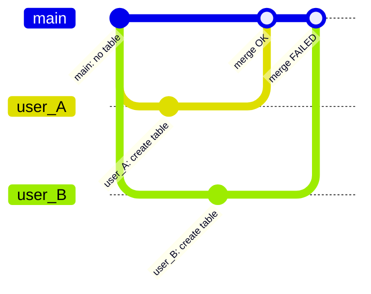
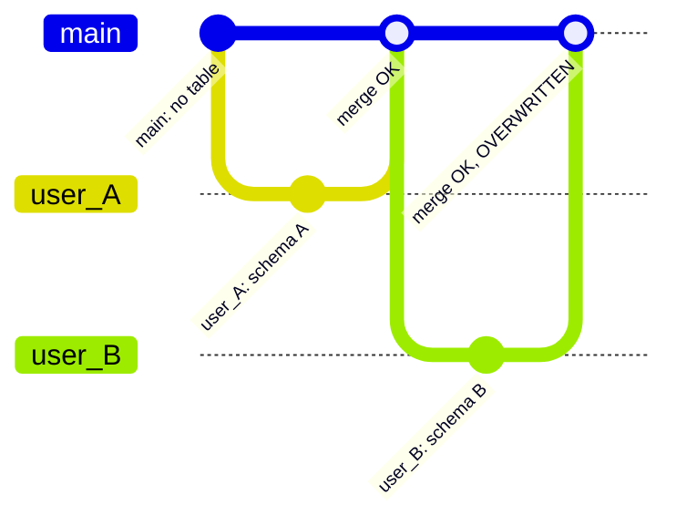
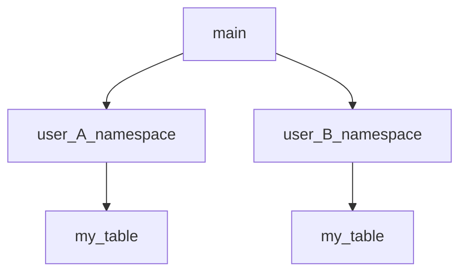
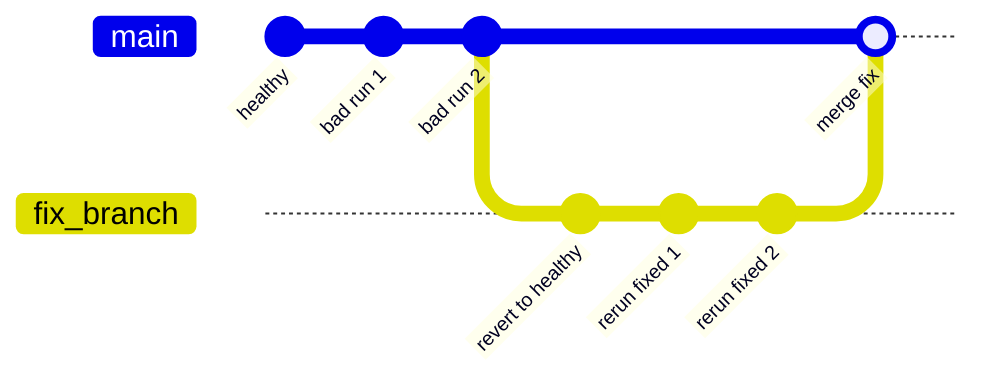

Bauplan's Git-like branching means multiple people and pipelines can work on the
same data without stepping on each other. But, just like with Git, you eventually
need to merge branches, and that is where conflicts surface. This page walks through
the most common conflict scenarios and how Bauplan's branching model helps
you handle them safely.

Full runnable versions of these examples are available on [https://github.com/BauplanLabs/bauplan/tree/main/examples/learn](https://github.com/BauplanLabs/bauplan/tree/main/examples/learn).

| Scenario | What it shows |
|---|---|
| Concurrency conflict | Two users independently create the same table, and Bauplan rejects the second merge |
| Naming conflict | Two pipelines write to the same table name, showing silent overwrite vs. namespace isolation |
| Schema drift conflict | An expectation catches a subtle type drift before it can reach the branch |
| Corruption conflict | Revert a corrupted table to a healthy state and repopulate it |

---

## Concurrency conflict

Two users branch off `main` at roughly the same time, when a target table does
not yet exist. Both run the same pipeline in isolation. User A merges first,
publishing the table on `main`. When user B then tries to merge, Bauplan rejects
the merge: `main` and user B's branch both independently introduce the same
table from different histories.



### Why this matters

User A's makes `main` go from "no table" to "user A's
table." `main` has not moved since user A branched, so the merge goes through cleanly. 
User B branched from the same prior commit, so both `main` and user B
introduce the table from divergent histories. Bauplan cannot reconcile the two
automatically, so it rejects the merge to protect `main` rather than silently
overwrite user A's work. User B should re-run the pipeline on a fresh branch
off the new `main`.

---

## Naming conflict

Two users write a table with the same name from different sources, with
different schemas. Unlike the concurrency case, here the users act
sequentially: user B branches off `main` *after* user A has already merged.
Both merges succeed, and that is exactly the problem.



From Bauplan's perspective, user B's merge is a legitimate update to an existing
table: same fully qualified name, new content. Bauplan raises no error and
silently replaces user A's schema and data.

### Resolve with namespaces

A namespace behaves like a directory. When each user writes to their own
namespace, the fully qualified names differ and both tables coexist on `main`.



### Why this matters

Bauplan resolves a bare table name to a fully qualified `<namespace>.<table>`
form, defaulting to the `bauplan` namespace when not specified. Two pipelines targeting the same
bare name in the default namespace will collide. Pushing each one into a
user-specific namespace is the idiomatic way to let independent producers share
a branch without overwriting each other.

<Note>
  Even when an overwrite happens, the previous state is not lost forever because
  Bauplan supports time-travel, so you can recover the lake state from before
  the conflicting merge.
</Note>

---

## Schema drift conflict

Schema drift rarely arrives as an obvious break. It slips in as a subtle change
and the pipeline still "works": the output table is there, row counts still
look right. What changes is the contract with downstream consumers, and the
break surfaces far from its source.

[Expectations](/concepts/expectations) turn that implicit contract into
executable code that lives next to the model. Run the pipeline with
`strict="on"` so a failed expectation fails the run:

```python
#! import bauplan
#! client = bauplan.Client()
run_state = client.run(
    project_dir="path/to/pipeline",
    ref="my_branch",
    strict="on",
)

if run_state.job_status.lower() != "success":
    print(f"Run blocked by the expectation. Reason: {run_state.error}.")
```

### Why this matters

Because the expectation is part of the pipeline DAG and the run is `strict`,
it fires automatically after the model materializes. A new version of the
pipeline that violates the contract never reaches a mergeable state, so making
the merge conditional on run success is enough to keep `main` clean. You need
no explicit conflict handling because the bad branch simply never gets merged.

<Note>
   A judicious use of the `columns` parameter in the `@bauplan.model` decorator can complement expectations
   and further enforce schema compliance by restricting the columns the function will output. For instance, the following
   would fail when `strict="on"`. For other uses of expectations in Bauplan, please consult the [dedicated example](https://github.com/BauplanLabs/bauplan/tree/b31d9226d5c8177a1974e97aa93ed710256e10fa/examples/learn/02-data-quality-expectations).
   ```python
   #!import bauplan
   @bauplan.python("3.12")
   @bauplan.model(columns=["Age"], materialization_strategy="REPLACE")
   def give_back_age(
       data=bauplan.Model("titanic")
   ):
       return data.select(["PassengerId", "Age"])
   ```
</Note>

---

## Corruption conflict

A scheduled pipeline writes to a shared table on a recurring cadence. After
several runs, you discover a bug in the transformation: the rows are still
there, but the values are wrong. You must repair the historical data without
disturbing the production table mid-flight, and ideally without anyone
downstream noticing intermediate states.

The general recipe has three steps:

1. **Pin the last healthy state** by snapshotting the branch hash from before
   the bad runs. This anchors the fix to a precise point in history.
2. **Repair on an isolated branch.** Revert the affected table to the pinned
   state and replay the fixed pipeline as many times as needed.
3. **Merge once.** A single merge swaps the corrected table back into
   production atomically.



### Why this matters

The repair runs entirely on a side branch and is only swapped back in via a
single merge. From any consumer's perspective the table changes exactly once,
atomically: there is no window in which the production table is half-fixed or
missing rows.

<Note>
  This flow assumes no concurrent writers touch the underlying table between
  the moment you branch off and the moment you merge back. If other pipelines
  are still writing in flight, merging back may itself produce a [concurrency
  conflict](#concurrency-conflict).
</Note>
