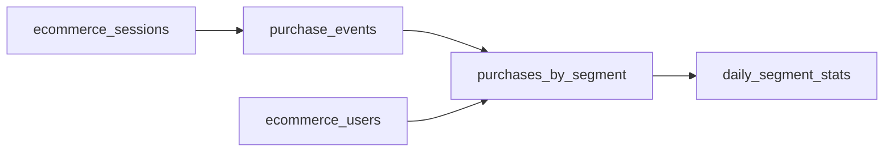

import Tabs from "@theme/Tabs";
import TabItem from "@theme/TabItem";

When a pipeline grows past a single model, you need to decide how data
flows between stages, what gets materialized, and how to keep each step
efficient. This walkthrough builds a three-stage e-commerce analytics
pipeline from scratch, introducing key patterns as they come up.

The finished DAG looks like this:

---



---

- `ecommerce_sessions` and `ecommerce_users` are source tables already
  in the lakehouse.
- `purchase_events` filters raw session events down to purchases and
  cleans the data.
- `purchases_by_segment` joins purchases with user segments - a
  multi-input model.
- `daily_segment_stats` aggregates to daily revenue per customer
  segment - the final output.

## Set up the project

Create a project folder with a `bauplan_project.yml`:

```yaml
project:
  id: 550e8400-e29b-41d4-a716-446655440000
  name: ecommerce_analytics
```

Before writing any models, create a
[data branch](/common-scenarios/branching-workflows) to work on:

```sh
bauplan checkout -b <username>.ecommerce-pipeline
```

<Note>
  For best suggested practices around branching you can see [branching
  workflows](/common-scenarios/branching-workflows).
</Note>

Verify that the source tables exist and inspect their schemas - you will
need this to choose the right columns and filters:

```sh
bauplan table get bauplan.ecommerce_sessions
bauplan table get bauplan.ecommerce_users
```

## Stage 1: Filter to purchases

The first model reads from the lakehouse and filters raw session events
down to completed purchases. Two things to note here:

- **I/O pushdown.** The `columns` and `filter` parameters on
  `bauplan.Model()` push restrictions down to the Iceberg layer, so the
  function only receives the data it needs. On large tables this can
  reduce data transfer by orders of magnitude.
- **Import dependencies inside the function.** Each model runs in its
  own isolated container. Only `bauplan` itself can be imported at the
  top level - everything else goes inside the function body, matching
  the packages declared in `@bauplan.python()`.

```python title="models.py"
import bauplan


@bauplan.model(
    columns=['event_time', 'product_id', 'category_code',
             'brand', 'price', 'user_id'],
)
@bauplan.python('3.11', pip={'polars': '1.15.0'})
def purchase_events(
    raw=bauplan.Model(
        'ecommerce_sessions',
        columns=['event_time', 'event_type', 'product_id',
                 'category_code', 'brand', 'price', 'user_id'],
        filter="event_type = 'purchase' AND price > 0",
    )
):
    import polars as pl

    df = pl.from_arrow(raw)
    result = df.with_columns(
        pl.col('brand').fill_null('Unknown'),
        pl.col('category_code').fill_null('uncategorized'),
    ).drop('event_type')
    return result.to_arrow()
```

The `columns` list on `@bauplan.model()` declares the expected output
schema. Bauplan validates the actual output against it, catching schema
drift before it reaches downstream consumers.

## Stage 2: Join with user segments

This model takes two inputs - Bauplan resolves dependencies automatically
based on the `bauplan.Model()` references.

**Notice** that each input uses `columns` to select only what it needs:

```python title="models.py"
...

@bauplan.model(
    columns=['event_time', 'category_code', 'brand', 'price',
             'customer_segment'],
)
@bauplan.python('3.11', pip={'polars': '1.15.0'})
def purchases_by_segment(
    purchases=bauplan.Model(
        'purchase_events',
        columns=['event_time', 'category_code', 'brand',
                 'price', 'user_id'],
    ),
    users=bauplan.Model(
        'ecommerce_users',
        columns=['user_id', 'customer_segment'],
    ),
):
    import polars as pl

    purchases_df = pl.from_arrow(purchases)
    users_df = pl.from_arrow(users)
    result = purchases_df.join(
        users_df,
        on='user_id',
    ).drop('user_id')
    return result.to_arrow()
```

## Stage 3: Daily segment statistics

The final model produces the table you actually care about.

This is also a good place to choose between Polars and DuckDB. Both
operate natively on Arrow with zero-copy reads - pick whichever fits the
transformation. Polars is a good default for DataFrame-style operations;
DuckDB shines when the logic reads more naturally as SQL. Avoid Pandas when possible -
it requires a full data copy and uses more memory.

<div id="stage-3">
<Tabs>
  <TabItem value="polars" label="Polars">

```python title="models.py"
...

@bauplan.model(
    columns=['date', 'customer_segment', 'total_purchases',
             'total_revenue', 'avg_order_value'],
    materialization_strategy='REPLACE',
)
@bauplan.python('3.11', pip={'polars': '1.15.0'})
def daily_segment_stats(
    data=bauplan.Model(
        'purchases_by_segment',
        columns=['event_time', 'price', 'customer_segment'],
    )
):
    import polars as pl

    df = pl.from_arrow(data)
    result = df.with_columns(
        pl.col('event_time').str.slice(0, 10).alias('date'),
    ).group_by(['date', 'customer_segment']).agg([
        pl.len().alias('total_purchases'),
        pl.col('price').sum().round(2).alias('total_revenue'),
        pl.col('price').mean().round(2).alias('avg_order_value'),
    ]).sort('date', 'customer_segment')
    return result.to_arrow()
```

  </TabItem>
  <TabItem value="duckdb" label="DuckDB">

```python title="models.py"
...

@bauplan.model(
    columns=['date', 'customer_segment', 'total_purchases',
             'total_revenue', 'avg_order_value'],
    materialization_strategy='REPLACE',
)
@bauplan.python('3.11', pip={'duckdb': '1.0.0'})
def daily_segment_stats(
    data=bauplan.Model(
        'purchases_by_segment',
        columns=['event_time', 'price', 'customer_segment'],
    )
):
    import duckdb

    con = duckdb.connect()
    con.register('purchases', data)
    return con.execute("""
        SELECT SUBSTRING(event_time, 1, 10) AS date,
               customer_segment,
               COUNT(*) AS total_purchases,
               ROUND(SUM(price), 2) AS total_revenue,
               ROUND(AVG(price), 2) AS avg_order_value
        FROM purchases
        GROUP BY 1, 2
        ORDER BY 1, 2
    """).fetch_arrow_table()
```

  </TabItem>
</Tabs>
</div>

## Choose what to materialize

In this example only `daily_segment_stats` has
`materialization_strategy='REPLACE'`. The first two models stream their
output as in-memory Arrow tables and are never persisted to the
lakehouse.

| Model                  | Materialized?   | Why                                                |
| ---------------------- | --------------- | -------------------------------------------------- |
| `purchase_events`      | No              | An intermediate cleanup step, not queried directly |
| `purchases_by_segment` | No              | An intermediate join operation                     |
| `daily_segment_stats`  | Yes (`REPLACE`) | The table downstream consumers actually read       |

If you do need to query intermediate results (for example, during
development), add `materialization_strategy='REPLACE'` temporarily and
remove it before the final run.

## Validate and run

Dry-run first to validate the DAG, check source tables, and verify
output column declarations - without materializing anything:

```sh
bauplan run --dry-run
```

Add `--strict on` during development to fail immediately on runtime
warnings (such as column mismatches or failing [expectations](/concepts/expectations)) instead of
completing with a warning:

```sh
bauplan run --dry-run --strict on
```

Once the dry run passes, execute the pipeline:

```sh
bauplan run
```

Then verify the output:

```sh
bauplan table get bauplan.daily_segment_stats
bauplan query "SELECT * FROM bauplan.daily_segment_stats LIMIT 5"
```
