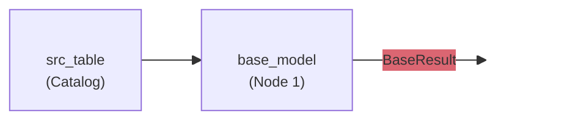
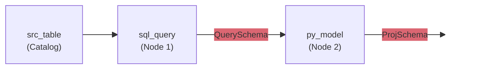

In Bauplan, **semantic annotations** augment data pipelines with static type checking and
semantic documentation. These annotations are used to build a rich representation of the
data pipeline for validation of data constraints, type checking of table schemas, and
propagation of metadata to and from the catalog.


## Introduction

To highlight the building blocks for Bauplan's semantic annotations, we start with a
simple data pipeline consisting of a single Python model, `base_model` whose
output is specified to have the schema `BaseResult`. This model receives its input
from the model `src_table`, whose schema is determined from the catalog directly.



This one-node DAG is defined in Python (with descriptive comments) as:

```python type:ignore
import pyarrow
from typing import Annotated

import bauplan
from bauplan import TableField, TableSchema, Float64

# A `TableSchema` with one attribute
class BaseResult(TableSchema):
    """An output schema."""

    # Annotated `TableField` for column metadata and constraints
    tfield_double: Annotated[
        Float64 | None, # column data type (may contain NULL values)
        TableField(),   # column metadata (accepts `doc` or `lineage`)
    ]

@bauplan.model()
@bauplan.python('3.11')
def base_model(
    # a `pyarrow.Table` that is output by the `src_table` model
    data: Annotated[pyarrow.Table, bauplan.Model('src_table')],

    # returns a `pyarrow.Table` with the schema `BaseResult`
) -> Annotated[pyarrow.Table, BaseResult]:

    # this model projects a single column from `data`
    return data.select(['src_col_double']).rename_columns(['tfield_double'])
```

There are three building blocks for pipeline type annotations:

### `DataType`

The type of data a table column will have. We support Apache Arrow types that are also
supported by Apache Iceberg, but we use system-agnostic names that mostly follow Arrow's
type names.

| Bauplan | PyArrow | Iceberg |
|---------|---------|---------|
| `Any` | - | - |
| `Bool` | `bool_()` | `boolean` |
| `Int32` | `int32()` | `int` |
| `Int64` | `int64()` | `long` |
| `Float64` | `float64()` | `double` |
| `String` | `large_string()` | `string` |
| `Binary` | `large_binary()` | `binary` |
| `Date32` | `date32()` | `date` |
| `Date64` | `date64()` | no equivalent |
| `TimestampMicro` | `timestamp('us')` | `timestamp` |
| `TimestampNano` | `timestamp('ns')` | `timestamp_ns` |
| `TimestampMicroUTC` | `timestamp('us', tz='UTC')` | `timestamptz` |
| `TimestampNanoUTC` | `timestamp('ns', tz='UTC')` | `timestamptz_ns` |

`Any` represents a "passthrough" that skips type checking of the table column. This is
best used for types that Bauplan does not yet support (such as `list`, `decimal128`, and
others).

`Date64` has no Iceberg counterpart, so no catalog column reads back as `Date64`.
Use `Date32` for dates you read from or write to the catalog.

The UTC timestamps hold absolute instants. Iceberg stores them as UTC and does not
preserve the timezone they were written from.

### `TableSchema`

An ordered grouping of attributes that is associated with Bauplan models. A `TableSchema`
must be associated with each model output and describes the expected output schema and
holds documentation. It may also be optionally associated with an input model to project
an expected schema.

```python type:ignore
from bauplan import TableSchema, Float64

# A schema specification must subclass `TableSchema`
class BaseResult(TableSchema):
    """An output schema."""

    # typed tabled field with no other metadata or constraints
    double_val: Float64 # "required" column may not contain null values
```

### `TableField`

Metadata and constraints associated with a table column. Initial support includes:

- `doc`, containing documentation for the column
- `lineage`, representing dependencies between columns (data flow)

```python type:ignore
import bauplan

class DerivedSchema(bauplan.TableSchema):
    """Schema that is "downstream" from `BaseResult` schema."""

    # Float64 with metadata or constraints
    tfield_double: Annotated[
        Float64 | None, # "optional" column may contain null values
        TableField(
            doc='A column specification with metadata',
            lineage=BaseResult['double_val'],
        ),
    ]
```

Most semantic information is defined in schema attributes and optional `TableField`
annotations. The `TableSchema` bridges column-level metadata and constraints with models
(annotation on the return value) and their input tables (annotations on function
parameters).

### Writing metadata to the lakehouse

The metadata specified on `TableField` and `TableSchema` instances are persisted to the
lakehouse for later access, even from external systems. Specifically, Bauplan persists:
- A column's "nullability", meaning whether null values are accepted (optional) or not
  accepted (required).
- Column documentation from the `doc` parameter for a `TableField`
- Table documentation from the python docstring of a python model if it is defined.
  - If the python model does not have a docstring, the docstring from the output
    `TableSchema` is used instead.
  - Similarly, if the model is a SQL model instead of a python model, the docstring from
    the associated `output_schema` is used for the table documentation.

Column nullability is stored with the column type in a straightforward way; for an
`Int64` type this is equivalent to:

```python
# pyarrow representation of `Int64 | None`
pyarrow.field('name', pyarrow.int64(), nullable=True)
```

Column documentation is stored in the `doc` property of the corresponding schema field as
shown in the Apache Iceberg spec for [JSON serialization of
schemas](https://iceberg.apache.org/spec/#schemas).

Table documentation is stored in the `comment` property of the table properties as
described in the Apache Iceberg documentation for [informational
properties](https://iceberg.apache.org/docs/latest/configuration/#informational-properties).


## Working example

As a working example, here is a multi-language DAG with two nodes: (**Node 1**) a SQL
model named `sql_query` and (**Node 2**) a Python model named `py_model`. All annotations
are defined in Python, such as `QuerySchema` and `ProjSchema`, but they can be referenced
from each model for cross-language guarantees.



The data flow is linear from the catalog to the SQL model to the Python model, but
altogether you get a data pipeline that explicitly declares the output schema of each
node and guarantees that there is a clear lineage for a column that flows from end to
end.

```python
from typing import Annotated
import bauplan

class QuerySchema(bauplan.TableSchema):
    """Schema of a result table from a SQL query."""

    tfield_double: bauplan.Float64
    tfield_timestamp: Annotated[
        bauplan.TimestampMicroUTC | None,
        bauplan.TableField(
            doc="timestamp for pyarrow.timestamp('us', tz='UTC') or timestamptz",
        ),
    ]

class ProjSchema(bauplan.TableSchema):
    """Schema for a simple projection."""

    tfield_timestamp: Annotated[
        bauplan.TimestampMicroUTC | None,
        bauplan.TableField(lineage=QuerySchema['tfield_timestamp']),
    ]

@bauplan.model()
@bauplan.python('3.11')
def py_model(
    data: Annotated[
        pyarrow.Table,
        bauplan.Model('sql_query', projection_schema=ProjSchema)
    ],

    # returns a `pyarrow.Table` with the schema `ProjSchema`
) -> Annotated[pyarrow.Table, ProjSchema]:
    """Model that returns a simple projection of `sql_query` results."""
    return data
```

Here is a SQL snippet showing a SQL model:

```sql
-- bauplan: name = sql_query
-- bauplan: output_schema = QuerySchema
SELECT  src_col_double    AS tfield_double
       ,src_col_timestamp AS tfield_timestamp
  FROM src_table
```


### Python models

A model must associate its output table with a defined schema in its return type annotation:

```python type:ignore
@bauplan.model()
@bauplan.python('3.11')
def py_model(...) -> Annotated[pyarrow.Table, ProjSchema]:
    ...
```

This associates the schema `ProjSchema` with the result table returned by `py_model`.
This triggers validation that the result table schema matches the specified `ProjSchema`
at execution time.

For input models, annotations include proper data types and an annotation to identify the
source model:

```python type:ignore
@bauplan.model()
@bauplan.python('3.11')
def py_model(
    data: Annotated[
        pyarrow.Table,
        bauplan.Model('sql_query', projection_schema=ProjSchema)
    ],
) -> Annotated[pyarrow.Table, ProjSchema]:
    return data
```

For the parameter `data`, the use of `pyarrow.Table` as the first argument to `Annotated`
tells a local type checker that `data` is a `pyarrow.Table` and the type checker will
provide appropriate feedback even in the function body. Along with the return type
annotation, the local type checker can help validate that `data` remains a
`pyarrow.Table` throughout the function body.

The annotation `bauplan.Model('sql_query', ...)` specifies that `data` comes from the
result of the `sql_query` model, which is specified to have the schema `QuerySchema`. In
contrast to the `base_model` example, this annotation also specifies an argument for
`projection_schema` so that `py_model` need not apply a projection in its function body.
When applying the projection, Bauplan will validate that `sql_query` has the column
`tfield_timestamp` available as specified by the `lineage` constraint for
`ProjSchema.tfield_timestamp`.


### SQL models

Semantic annotations are defined in Python and must be associated with SQL models with a
directive:

```sql
-- bauplan: output_schema = QuerySchema
```

The definition of `QuerySchema` must exist in Python, but is referenced by a SQL query so
that Bauplan can determine how to validate the result schema of `sql_query`. Attribute
names in the `TableSchema` class are matched up against columns of the same name in the
table results and validation will check both data types and specified constraints
(nullable and lineage).
