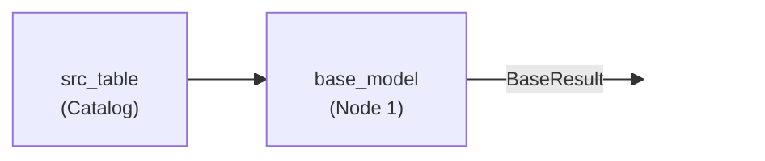
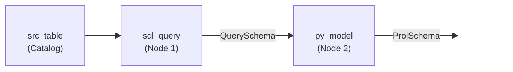

:::caution Preview feature

This is a preview feature. Please contact Bauplan to enable it.

:::


In Bauplan, **semantic annotations** can be used to augment data pipelines with static
type checking and semantic documentation. These annotations are used to build a rich
representation of the data pipeline for validation of data constraints, type checking
of table schemas, and propagation of metadata to and from the catalog.


## Introduction

To highlight the building blocks for Bauplan's semantic annotations, we start with a
simple data pipeline consisting of a single Python model, `base_model` whose
output is specified to have the schema `BaseResult`. This model receives its input
from the model `src_table`, whose schema is determined from the catalog directly.



This one-node DAG is defined in Python (with descriptive comments) as:

```python type:ignore
import pyarrow
from typing import Annotated

# Annotations are temporarily available in a `bpln_sdk` namespace
import bpln_sdk as bauplan
from bpln_sdk import TableField, TableSchema, Float64

# A `TableSchema` with one attribute
class BaseResult(TableSchema):
    """An output schema."""

    # Annotated `TableField` for column metadata and constraints
    tfield_double: Annotated[
        Float64,                                           # column data type
        TableField(lineage="src_table['src_col_double']"), # column metadata
    ]

@bauplan.model()
@bauplan.python('3.11')
def base_model(
    # a `pyarrow.Table` that is output by the `src_table` model
    data: Annotated[pyarrow.Table, bauplan.Model('src_table')],

    # returns a `pyarrow.Table` with the schema `BaseResult`
) -> Annotated[pyarrow.Table, BaseResult]:

    # this model projects a single column from `data`
    return data.select(['src_col_double']).rename_columns(['tfield_double'])
```

There are three building blocks for pipeline type annotations:

### `DataType`

The type of data a table column will have. We support Apache Arrow types that are also
supported by Apache Iceberg, but we use system-agnostic names that mostly follow Arrow's
type names. Currently, we support the following data types: `Bool`, `Int32`, `Int64`,
`Float64`, `String`, `Binary`, `TimestampMicro`, `TimestampNano`, `TimestampMicroUTC`,
`TimestampNanoUTC`.

```python type:ignore
# Float64 without metadata
tfield_double: Float64
```

### `TableField`

Metadata and constraints associated with a table column. Initial support includes:
documentation fields (`title` and `doc`), `nullable`, and explicit column `lineage`.

```python type:ignore
# Float64 with metadata or constraints
tfield_double: Annotated[
    Float64,
    TableField(
        title='TableField: tfield_double',
        doc='An example TableField for column metadata',
        nullable=True,
        lineage="src_table['src_col_double']",
    ),
]
```

### `TableSchema`

An ordered grouping of `TableField` attributes that can be associated with Bauplan
models.

```python type:ignore
# A "schema contract" that is defined by subclassing `TableSchema`
class BaseResult(TableSchema):
    """An output schema."""

    # Annotated `TableField` for column metadata and constraints
    tfield_double: Annotated[
        Float64,                                           # column data type
        TableField(lineage="src_table['src_col_double']"), # column metadata
    ]
```

Most semantic information is defined in `TableField` annotations that are grouped as a
`TableSchema`; then, the `TableSchema` is associated with various input tables and the
output table of a Bauplan `model`.

## Working example

As a working example, here is a multi-language DAG with two nodes: (**Node 1**) a SQL
model named `sql_query` and (**Node 2**) a Python model named `py_model`. All annotations
are defined in Python, such as `QuerySchema` and `ProjSchema`, but they can be referenced
from each model for cross-language guarantees.



The data flow is linear from the catalog to the SQL model to the Python model, but
altogether you get a data pipeline that explicitly declares the output schema of each
node and guarantees that there is a clear lineage for a column that flows from end to
end.

```python type:ignore
class QuerySchema(TableSchema):
    """Schema of a result table from a SQL query."""

    tfield_double: Float64
    tfield_timestamp: Annotated[
        TimestampMicroUTC,
        TableField(
            doc="timestamp for pyarrow.timestamp('us', tz='UTC') or timestamptz",
            lineage="src_table['src_col_timestamp']",
        ),
    ]

class ProjSchema(TableSchema):
    """Schema for a simple projection."""

    tfield_timestamp: Annotated[
        TimestampMicroUTC,
        TableField(lineage=QuerySchema['tfield_timestamp']),
    ]

@bauplan.model()
@bauplan.python('3.11')
def py_model(
    data: Annotated[
        pyarrow.Table,
        bauplan.Model('sql_query', projection_schema=ProjSchema)
    ],

    # returns a `pyarrow.Table` with the schema `ProjSchema`
) -> Annotated[pyarrow.Table, ProjSchema]:
    """Model that returns a simple projection of `sql_query` results."""
    return data
```

Here is a SQL snippet showing a SQL model:

```sql
-- bauplan: name = sql_query
-- bauplan: output_schema = QuerySchema
SELECT  src_col_double    AS tfield_double
       ,src_col_timestamp AS tfield_timestamp
  FROM src_table
```


### Python models

A model must associate its output table with a defined schema in its return type annotation:

```python type:ignore
@bauplan.model()
@bauplan.python('3.11')
def py_model(...) -> Annotated[pyarrow.Table, ProjSchema]:
    ...
```

This associates the schema `ProjSchema` with the result table returned by `py_model`.
This triggers validation that the result table schema matches the specified `ProjSchema`
at execution time.

For input models, annotations include proper data types and an annotation to identify the
source model:

```python type:ignore
@bauplan.model()
@bauplan.python('3.11')
def py_model(
    data: Annotated[
        pyarrow.Table,
        bauplan.Model('sql_query', projection_schema=ProjSchema)
    ],
) -> Annotated[pyarrow.Table, ProjSchema]:
    return data
```

For the parameter `data`, the use of `pyarrow.Table` as the first argument to `Annotated`
tells a local type checker that `data` is a `pyarrow.Table` and the type checker will
provide appropriate feedback even in the function body. Along with the return type
annotation, the local type checker can help validate that `data` remains a
`pyarrow.Table` throughout the function body.

The annotation `bauplan.Model('sql_query', ...)` specifies that `data` comes from the result of
the `sql_query` model, which is specified to have the schema `QuerySchema`. In contrast
to the `base_model` example, this annotation also specifies an argument for
`projection_schema` so that `py_model` need not apply a projection in its function body.
When applying the projection, Bauplan will validate that `sql_query` has the column
`tfield_timestamp` available as specified by the `lineage` constraint for
`ProjSchema.tfield_timestamp`.


### SQL models

Semantic annotations are defined in Python and must be associated with SQL models with a
directive:

```sql
-- bauplan: output_schema = QuerySchema
```

The definition of `QuerySchema` must exist in Python, but is referenced by a SQL query so
that Bauplan can determine how to validate the result schema of `sql_query`. Attribute
names in the `TableSchema` class are matched up against columns of the same name in the
table results and validation will check both data types and specified constraints
(nullable and lineage).
