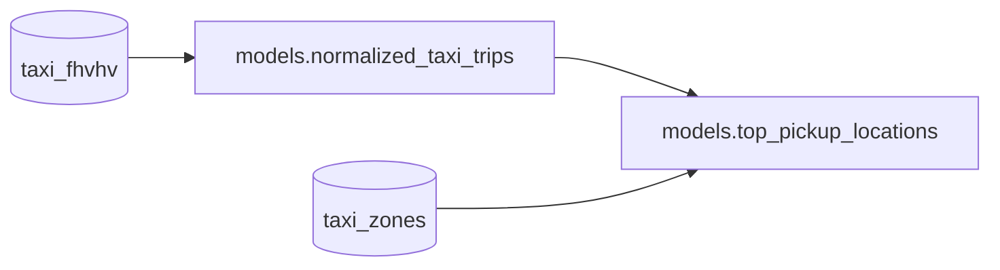

[Open in Github](https://github.com/BauplanLabs/examples/tree/main/02-data-visualization-app)

We'll use the TLC NY Taxi dataset and build a
pipeline that combines data from the Yellow Taxi Records with the
Taxi Zone Lookup Table. The
pipeline will generate a table named `top_pickup_location`, which
displays the boroughs and zones in New York City with the highest number
of taxi pickups. Finally, we'll use Streamlit to visualize this table
in an interactive app.

## Set up

To begin, install bauplan and set up your project

## Pipeline

The final shape of the pipeline is the the following:



This pipeline has two main components:

- trips_and_zones: this function performs two scans on S3
  using Python and joins the results with PyArrow. The scans retrieve
  data from the `taxi_fhvhv` and `taxi_zones` tables, filtering
  records based on pickup timestamps. The join operation aligns taxi
  trips with their corresponding pickup locations by matching the
  PULocationID field with LocationID.
- top_pickup_locations: this function uses Pandas
  to aggregate and sort the data from `trips_and_zones`. It groups
  taxi trips by `PULocationID`, `Borough`, and `Zone` and orders the
  results by the total number of trips, producing a table of the most
  popular pickup locations in New York City.

While it is not mandatory to collect models in a single models.py file,
we recommend it as a best practice for keeping the pipeline's logic
centralized and organized. The `top_pickup_locations` function uses the
`materialization_strategy='REPLACE'` flag to persist the results as an
Iceberg table. This materialization makes the data queryable and ready
for visualization in Streamlit.

```python notest
import bauplan

@bauplan.model()
@bauplan.python('3.11')
def trips_and_zones(
        trips=bauplan.Model(
            'taxi_fhvhv',
            # this function does an S3 scan directly in Python, so we can specify the columns and the filter pushdown
            # by pushing the filters down to S3 we make the system considerably more performant
            columns=[
                'pickup_datetime',
                'dropoff_datetime',
                'PULocationID',
                'DOLocationID',
                'trip_miles',
                'trip_time',
                'base_passenger_fare',
                'tips',
            ],
            filter="pickup_datetime >= '2023-01-01T00:00:00-05:00' AND pickup_datetime < '2023-02-02T00:00:00-05:00'"
        ),
        zones=bauplan.Model(
            'taxi_zones',
        ),
):
    """
    this function does an S3 scan over two tables - taxi_fhvhv and zones - filtering by pickup_datetime
    it then joins them over PULocationID and LocationID using Pyarrow https://arrow.apache.org/docs/python/index.html
    the output is a table with the taxi trip the taxi trips in the relevant period and the corresponding pickup Zones
    """

    import math

    # the following code is PyArrow
    # because Bauplan speaks Arrow natively you don't need to import PyArrow explicitly
    # join 'trips' with 'zones' on 'PULocationID' and 'LocationID'
    pickup_location_table = (trips.join(zones, 'PULocationID', 'LocationID').combine_chunks())
    # print the size of the resulting table
    size_in_gb = round(pickup_location_table.nbytes / math.pow(1024, 3), 3)
    print(f"\nThis table is {size_in_gb} GB and has {pickup_location_table.num_rows} rows\n")

    return pickup_location_table


# this function explicitly requires that its output is materialized in the data catalog as an Iceberg table
@bauplan.model(materialization_strategy='REPLACE')
@bauplan.python('3.11', pip={'pandas': '2.2.0'})
def top_pickup_locations(data=bauplan.Model('trips_and_zones')):
    """
    this function takes the parent table with the taxi trips and the corresponding pickup zones
    and groups the taxi trips by PULocationID, Borough and Zone sorting them in descending order
    the output is the table of the top pickup locations by number of trips
    """

    import pandas as pd

    # convert the input Arrow table into a Pandas dataframe
    df = data.to_pandas()

    # group the taxi trips by PULocationID, Borough and Zone and sort in descending order
    # the result will be a Pandas dataframe with all the pickup locations sorted by number of trips
    top_pickup_table = (
        df
        .groupby(['PULocationID', 'Borough', 'Zone'])
        .agg(number_of_trips=('pickup_datetime', 'count'))
        .reset_index()
        .sort_values(by='number_of_trips', ascending=False)
    )
    # we can return a Pandas dataframe
    return top_pickup_table
```

## Run the Pipeline

First, create a new branch and switch to it.

```bash
bauplan branch create <YOUR_BRANCH>
bauplan branch checkout <YOUR_BRANCH>
```

Create a bauplan branch and run the pipeline in it so you will have a
table in it named `top_pickup_locations`,

With the new branch checked out, run the pipeline to materialize the
table `top_pickup_locations`.

```bash
bauplan run
```

After the pipeline completes, inspect the newly created
top_pickup_locations table in your branch to ensure
everything ran successfully.

```bash
bauplan table get top_pickup_locations
```

## Streamlit app

To visualize the data we will use [Streamlit](https://streamlit.io/), a
powerful Python framework to build web apps in pure Python. The example
below contains a Streamlit app to visualize the table
`top_pickup_location` created with the bauplan pipeline above. This
simple script shows how to use bauplan's Python SDK to embed querying
and other functionalities in a data app.

```python notest
import streamlit as st
import sys
from argparse import ArgumentParser
import plotly.express as px
import bauplan
import pandas as pd


@st.cache_data()
def query_as_dataframe(
        _client: bauplan.Client,
        sql: str,
        branch: str
) -> pd.DataFrame:
    """
    Runs a query with bauplan and put the table in a Pandas dataframe
    """
    try:
        df = _client.query(query=sql, ref=branch).to_pandas()
        return df
    except bauplan.exceptions.BauplanError as e:
        print(f"Error: {e}")
        return None


def plot_interactive_chart(df: pd.DataFrame) -> None:
    """
    Creates an interactive bar chart using Plotly Express
    """
    # Define the figure to display in the app
    fig = px.bar(
        df,
        y='Zone',
        x='number_of_trips',
        orientation='h',
        title='Number of Trips per Zone',
        labels={'number_of_trips': 'Number of Trips', 'Zone': 'Zone'},
        height=800
    )

    # Customize the layout
    fig.update_layout(
        showlegend=False,
        xaxis_title="Number of Trips",
        yaxis_title="Zone",
        hoverlabel=dict(bgcolor="white"),
        margin=dict(l=20, r=20, t=40, b=20)
    )

    # Display the plot in Streamlit
    st.plotly_chart(fig, use_container_width=True)


def main():
    # Set up command line argument parsing
    parser = ArgumentParser()
    parser.add_argument('--branch', type=str, required=True, help='Branch name to query data from')
    args = parser.parse_args()

    # set up the table name as a global
    table_name = 'top_pickup_locations'

    st.title('A simple data app to visualize taxi rides and locations in NY')

    # instantiate a bauplan client
    client = bauplan.Client()

    # Using the branch from command line argument
    branch = args.branch

    # Query the table top_pickup_locations using bauplan
    df = query_as_dataframe(
        _client=client,
        sql=f"SELECT * FROM {table_name}",
        branch=branch
    )

    if df is not None and not df.empty:
        # Add a toggle for viewing raw data
        if st.checkbox('Show raw data'):
            st.dataframe(df.head(50), width=1200)

        # Display the interactive plot
        plot_interactive_chart(df=df.head(50))
    else:
        st.error('Error retrieving data. Please check your branch name and try again.')


if __name__ == "__main__":
    main()
```

## Run the Streamlit app

Create a virtual environment, install the necessary requirements and
then run the Streamlit app. Remember that you will need to pass the
branch in which you materialized the target table as an argument in the
terminal.

```bash
uv run --with-requirements requirements.txt \
    streamlit run viz_app.py -- --branch <YOUR_BRANCH>
```

This app will simply visualize the final table of our pipeline, nothing
fancy.


## The programmable Lakehouse

One of the core strengths of bauplan is that every key operation on the
platform can be seamlessly integrated into other applications using its
straightforward Python SDK. Concepts such as plan creation, data import,
execution, querying, branching, and merging--demonstrated throughout
this documentation--are all accessible via simple SDK methods. This
design makes your data stack highly programmable and easy to embed into
any existing workflow, offering flexibility and efficiency for modern
data-driven applications. This Streamlit app serves as a simple example
of how Bauplan can be integrated into other applications using its
Python SDK. In this example, we demonstrate the use of the `query`
method, which allows bauplan to function as a query engine. With this
method, we can run arbitrary SQL queries and seamlessly convert the
results into a tabular objects (e.g. Pandas DataFrame). This enables us
to perform real-time interactive queries on any table within any branch
of the data catalog that we have access to, providing a powerful way to
explore and visualize data in real time.

## Summary

We have demonstrated how Bauplan can be used to develop a data pipeline
that powers a simple data visualization app. Through straightforward
abstractions, we achieved the following:

- Created a branch in our data catalog.
- Built a transformation pipeline leveraging multiple dependencies.
- Materialized the pipeline's results in the data lake as Iceberg
  tables.

Throughout the process, we did not need to manage runtime compute
configurations, containerization, Python environments, or the
persistence of data in the lake and catalog—Bauplan handled all of
that seamlessly. Moreover, with a simple import statement, we integrated
the bauplan runtime into our Streamlit app. Thanks to the Bauplan Python
SDK, embedding the platform's capabilities into other applications is
both intuitive and efficient.
