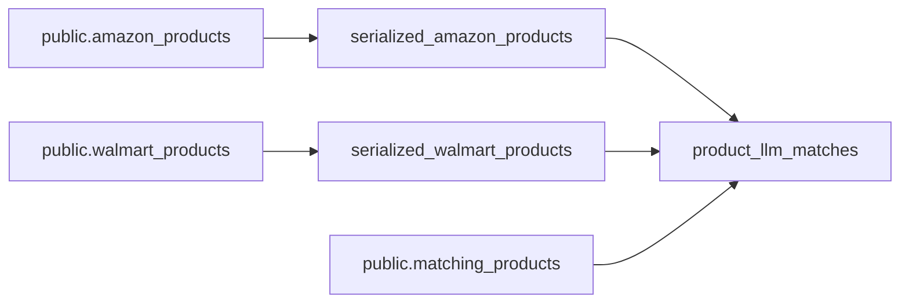

[Open in
Github.](https://github.com/BauplanLabs/examples/tree/main/07-entity-matching-with-llm)

## Overview

This example demonstrates an end-to-end entity matching pipeline for
e-commerce, combining [Bauplan](https://www.bauplanlabs.com/) for
seamless data preparation with OpenAI's off-the-shelf LLM APIs for
accurate matching.

Entity Matching (EM) is a common yet often tedious challenge for data
scientists. It involves identifying pairs of entries across datasets
that represent the same real-world entity--such as products,
publications, people, or businesses. For instance, in e-commerce, the
same product can be listed with different names, descriptions, and
prices across different websites.

Historically, Entity Matching (EM) has been a challenging task, often
involving complex data structures like graphs and a mess of manual
rules, heuristics, and hyper-specific model tuning for each dataset and
task.

Large Language Models (LLMs) offer a more flexible and generalized
approach. The concept, originally pioneered by [Chris Ré's
lab](https://arxiv.org/pdf/2205.09911), has gained [increasing
traction](https://arxiv.org/pdf/2310.11244) lately.

The key advantage of using LLMs for EM is the dramatic simplification of
pipelines. Instead of having to take care of training custom models,
build pipelines with manual rules, define dataset and task specific
heuristics, we can just call an LLM and use it as a pre-trained general
classifier. This can easily translate in getting rid of thousands of
lines of ad hoc code.


## The project

We are going to use the the Wallmart-Amazon dataset comes from the
[DeepMatcher
website](https://github.com/anhaidgroup/deepmatcher/blob/master/Datasets.md),
which contains product information from the Amazon and Walmart product
catalogues. Given the two product catalogs, we want to match the
products that are the same across the two datasets.

We build a bauplan pipeline to prepare the data for entity matching, and
then use an off-the-shelf LLM API to perform the matching: the entire
project runs end-to-end on object storage (S3), in open formats
(Iceberg), using nothing else than vanilla Python code to orchestrate
the DAG and integrate AI services.

We finally build a small Streamlit app to explore the predictions made
by the LLM model, leveraging again the pure Python APIs from bauplan.

In the end-to-end example, the data flow as follows between tools and
environments:

1.  The original dataset is stored in three Iceberg tables: one table
    for Walmart, one for Amazon, and one as a test set to simulate an
    application request for matches. All the datasets are available in
    bauplan [sandbox](https://www.bauplanlabs.com/#join) in the `public`
    namespace;
2.  The pipeline in `examples/07-entity-matching-with-llm/bpln_pipeline`
    contains the data preparation and training steps as simple decorated
    Python functions. Running the pipeline in bauplan will execute these
    functions and store the result of entity matching for the *test
    dataset* in a new, \"big\" table.
3.  The [Streamlit](https://streamlit.io/) app in `src/app` showcases
    how to get back the matches using bauplan and visualize them in a
    simple web interface


### The pipeline

The data pipeline processes raw data from the Amazon and Walmart tables
by creating new tables where the original columns (`id`, `title`,
`category`, `price`, `brand`) are combined into a single serialized
field.

These serialized tables, along with the `public.matching_products`
table, are then fed into the final node, which identifies product
matches using the serialized product information and LLM calls.



## Setup

### bauplan

-   [Join](https://www.bauplanlabs.com/#join) the bauplan sandbox, sign
    in, create your username and API key.
-   do the 3-min
    [tutorial](/tutorial/installation)
    to get familiar with the platform.

You can install the CLI with `pip` or `uv`:

```
uv tool install bauplan --upgrade
```

### Open AI

-   Sign up on [OpenAI](https://platform.openai.com/) to get your API
    key -- you're free to experiment with different LLMs by simply
    replacing the LLM utility code in the pipeline.

## Run the project

### Check out the dataset

Using bauplan, it is easy to get acquainted with the dataset and its
schema:

```sh
bauplan table get public.amazon_products
bauplan table get public.walmart_products
bauplan table get public.matching_products
```

Note for example that `public.matching_products` contains three columns:
the product id from the Walmart product catalog, the product id from the
Amazon product catalog, and a label indicating whether the two products
are the same or not.

This table will be used to simulate an application request for matches.
The column `label` will be used to evaluate the performance of the LLM
model as the ground truth.

You can quantify the test set imbalance with a simple query directly in
your CLI:

```sh
bauplan query "SELECT label, COUNT(*) as _C FROM public.matching_products GROUP BY 1"
```

### Run the pipeline with bauplan

Create a [data branch](/tutorial/data_branches) to develop your application.

```sh
cd src/bpln_pipeline
bauplan branch create <YOUR_USERNAME>.product_matching
bauplan branch checkout <YOUR_USERNAME>.product_matching
```

Now, add your OpenAI key as a secret to your project: this will allow
bauplan to connect OpenAI securely:

```sh
bauplan parameter set openai_api_key aaa --type secret
```

If you inspect your `bauplan_project.yml` file, the new parameter will
be found:

```yaml
parameters:
    openai_api_key:
        type: secret
        default: kUg6q4141413...
        key: awskms:///arn:aws:kms:us-...
```

You can now run the DAG:

```sh
bauplan run
```

Running the DAG will create a new table in your data lake branch names
`product_llm_matches`. You can check the schema of the new table with
the following command:

```sh
bauplan table get product_llm_matches
```

### Exploring LLM mistakes in Streamlit

We can visualize the predictions easily in any Python environment, using
the `bauplan` SDK library to interact with the tables we built by
running our pipeline. We provide a simple Streamlit app to do so.

To run the app:

```sh
cd src/app
streamlit run explore_matches.py -- --bauplan_user_name <YOUR_USERNAME>
```

The app will open in your browser, and you can start exploring the
predictions made by the LLM model vs the ground truth we have in the
test set: feel free to modify the query in the app to slice and dice the
data as you see fit (e.g. can you restrict the result for a certain
category only?).

## Where to go from here?

 -  The prompts used in this project come from
    [here](https://github.com/jacopotagliabue/foundation-models-for-dbt-entity-matching?tab=readme-ov-file)
    and could definitely use some improvement. How can you update the
    LLM code to leverage the latest LLM capabilities?
 -  Calling OpenAI APIs sequentially may be too slow. Since bauplan
    supports arbitrary dependencies into your functions, it could be
    useful to use multi-threaded processes to parallelize the calls and
    speed up the pipeline.

## License

The code in this repository is released under the MIT License and
provided as is.
