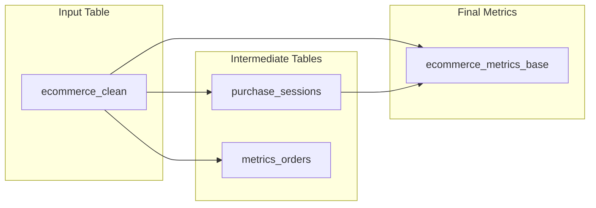

[Open in
Github.](https://github.com/BauplanLabs/examples/tree/main/06-near-real-time)

In this example, we demonstrate how to implement near real-time
analytics for e-commerce data using Bauplan,
[Prefect](https://www.prefect.io/), and
[Streamlit](https://streamlit.io/). The project demonstrates near
real-time processing, SQL/Python transformations, branch-based
development, and live metric visualization.

## Overview

Efficiently processing and analyzing data in near real-time is crucial
for deriving actionable insights and driving business decisions.
Applications often generate a continuous stream of product and user
behavior data that needs to be ingested, processed, and visualized with
minimal delay.

Consider an e-commerce website where we want to create dashboards
capturing behavioral patterns and key business metrics, such as total
revenue per day, total unique users per day, trends over time (e.g.,
revenue growth, user engagement metrics) and so on.

To achieve this, we need to:

1.  Ingest data streams from the application.
2.  Process the data in micro-batches or near real-time.
3.  Visualize metrics using a BI tool or a dashboarding framework like
    [Streamlit](https://streamlit.io/).
4.  Schedule and orchestrate the entire process.

In addition, we ideally want to implement a robust workflow that should
run quality checks on incoming data before feeding it into the pipeline,
because data can be corrupted or contain anomalies due to faulty
application behavior.

This can be easily attained using Bauplan built-in data branching which
is used in this example to implement a
[Write-Audit-Publish](https://dagster.io/blog/python-write-audit-publish)
(WAP) workflow with just a few lines of code.

In this example, we show how to:

-   Create analytics tables in bauplan using the "public.ecommerce"
    dataset (from [Kaggle's E-commerce Behavior
    Data](https://www.kaggle.com/datasets/mkechinov/ecommerce-behavior-data-from-multi-category-store/data)).
-   Simulate streaming data by appending rows to core tables and
    rebuilding downstream tables using Prefect for orchestration.
-   Implement data branching strategies to isolate ingestion from
    pipeline artifacts (WAP).
-   Visualize live results through a Streamlit dashboard reflecting the
    latest data from the main branch.


## Prerequisites

### bauplan API key

👉👉👉 To use Bauplan, you need an API key for our sandbox environment:
you can request one [here](https://www.bauplanlabs.com/#join). To get
familiar with the API, start with our
[tutorial](/tutorial/quick_start).

### AWS Setup

To simulate a continuous stream of incoming data, we use an S3 bucket.
You'll need AWS credentials with permissions to:

-   Create and manage S3 buckets.
-   Upload files.
-   List bucket contents.

## Quick Start

Open three tabs in your terminal.

### Terminal 1: Start a Prefect Server

```bash
uv run --with-requirements requirements.txt \
    prefect server start
```

Keep this terminal running. This process hosts the Prefect server that
manages the scheduled tasks and will be used to orchestrate the
ingestion and the WAP worflow.

### Terminal 2: Setup Prefect and run the pipeline

Configure Prefect (required before the first run)

```bash
uv run --with-requirements requirements.txt \
    prefect config set PREFECT_API_URL=http://127.0.0.1:4200/api
```

Set up AWS credentials in one of the following two ways:

1.  Environment variables:

```bash
export AWS_ACCESS_KEY_ID=your_key
export AWS_SECRET_ACCESS_KEY=your_secret
export AWS_DEFAULT_REGION=your-region  # e.g., us-east-1
```

AWS config file (recommended):

Follow the [AWS CLI configuration
guide](https://docs.aws.amazon.com/cli/v1/userguide/cli-configure-files.html).

After setting up AWS credentials, run:

```bash
uv run --with-requirements requirements.txt \
    orchestrator/run.py --username your_bauplan_username \
                        --namespace your_namespace \
                        --dev_branch your_branch \
                        --bucket_name your_bucket_name
```

### Terminal 3: Streamlit Dashboard

```bash
cd dashboard
streamlit run app.py
```

Keep this terminal running to maintain the Streamlit server up and use
the Dashboard.


## Project Structure
```text
    .
    ├── orchestrator/
    │   ├── run.py          # Main pipeline script
    │   └── utils.py        # One-off setup operations
    ├── pipeline_analytics/
    │   ├── models.py       # Core metrics computation
    │   └── *.sql           # SQL transformations
    └── dashboard/
        └── app.py          # Streamlit visualization
```

## What Happens When You Run the Script

When you run the script in the folder `orchestrator`, you trigger a
Prefect flow which is executed on a local Prefect server. The flow
contains some one-off setup operations that will be executed upon the
first execution and then run our transformation pipeline on a schedule
every 5 minutes.

This is meant to simulate the streaming of data coming form our
e-commerce application and the consequent quasi real-time processing to
keep the dashboard fresh.

### First Run: ONE-OFF Setup (utils.py)

-   Creates development branch from main
-   Builds initial cleaned dataset
-   Sets up S3 bucket for simulated events

### Every 5 Minutes: Scheduled Operations (run.py)

-   Simulates new e-commerce events.
-   Ingests data using temporary branches to implement a WAP workflow.
-   Run the analytics pipeline to updates the tables visualized in the
    Streamlit app.

## Analytics pipeline

In the `pipeline_analytics` folder, the file `models.py` contains three
bauplan functions that constitute our transformation pipelines to
generate the final table to visualize.

The pipeline creates a full funnel of metrics from browsing (views) to
purchasing (revenue), enabling analysis of:

-   User engagement (sessions)
-   Conversion (purchases)
-   Revenue performance
-   Brand-level trends
-   Hourly patterns

The analytics pipeline looks like this:



## Streamlit app and visualization

The project includes a simple Streamlit dashboard in `dashboard/app.py`
to visualize the final aggregated metrics from our analytics pipeline.
The dashboard provides an easy way to pick a branch and monitor the
calculated metrics with minimal setup.

### Usage

The visualization app is pretty straightforward:

-   Select your Bauplan username from the dropdown.
-   Choose the branch created by the analytics pipeline.
-   View your metrics instantly and keep track of the changes every 5
    minutes.

For more advanced Streamlit features and customization options, check
out the Streamlit documentation.

View the Streamlit dashboard at [http://localhost:8501](http://localhost:8501)

### Monitoring

Prefect provides a intuitive UI to monitor the whole workflow and
pipeline runs. Check Prefect UI at [http://localhost:4200](http://localhost:4200)

## Conclusion

This near real-time monitoring app is a simple yet powerful showcase of
how simple it is to build an end-to-end data application with Bauplan.

From managing raw data streams to quarantining bad data, transforming it
into useful insights, and presenting it visually, this implementation
juggles multiple data structures and frameworks seamlessly. Thanks to
Bauplan, the heavy lifting of infrastructure management is completely
out of sight, leaving you free to focus on what matters most: delivering
insights.

You never worry about servers, containers, data copies and table
versions. The whole business logic stays in two Python scripts that you
can run in the cloud from anywhere, one for the analytics pipeline and
one for the orchestration workflow.

Moreover, it is extremely easy to program workflows with other tools,
using Bauplan Python client to integrate with Streamlit for data
visualization and with Prefect for scheduling and orchestration.
