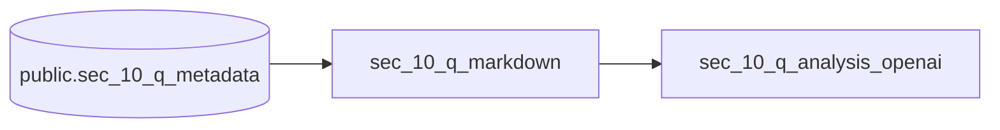

[Open in Github.](https://github.com/BauplanLabs/examples/tree/main/10-pdf-analysis-with-openai)

## Overview

This project demonstrates how to analyze financial documents (PDFs)
using [Bauplan](https://www.bauplanlabs.com/) for data preparation and
[OpenAI's GPT](https://chatgpt.com/?ref=dotcom) for text analysis.

## Use Case

We analyze quarterly financial reports of public companies to extract
insights on their performance and generate structured reports.

### Approach:

-   **Data Preparation:** A Bauplan pipeline processes raw financial
    PDFs into structured text.
-   **Text Analysis:** OpenAI APIs (ChatGPT) analyze the extracted
    content.
-   **Report Generation:** Bauplan formats the results into an Iceberg
    table stored in a data lake (S3).
-   **Visualization:** A [Streamlit](https://streamlit.io/) app provides
    an interactive UI to explore the reports.

The entire workflow runs in vanilla Python with open formats (Iceberg)
and object storage (S3), making it adaptable for various NLP tasks like
data augmentation, sentiment analysis, or financial comparisons.

## Data Source

We use financial PDFs from tech companies, sourced from the SEC 10-Q
dataset via [Llama Index](https://github.com/run-llama/llama_index).

## Pipeline



1.  PDFs and metadata (year, quarter, company, S3 path) are stored in an
    Iceberg table.
2.  The dataset is available in the public namespace upon [joining
    Bauplan](https://www.bauplanlabs.com/#join).
3.  The pipeline in `src/bpln_pipeline` contains the data preparation
    and LLM analysis as simple, decorated Python functions - we use the
    [markitdown](https://github.com/microsoft/markitdown) package to go
    from PDF files to the simple text format we feed to the model.
    Running the pipeline in Bauplan will execute these functions and
    store the results in a new table.
4.  The Streamlit in `src/app` showcases how to visualize the final
    table in a simple web interface.

Both the pipeline and the app code are heavily commented to help you go
through the code. Having said that, do not hesitate to reach out to the
Bauplan team for any questions or clarifications.

## Setup

### Bauplan

-   [Join](https://www.bauplanlabs.com/#join) the Bauplan sandbox, sign
    in, create your username and API key.
-   Complete the 3-min
    [tutorial](/tutorial/quick_start)
    to get familiar with the platform.
-   When you gain access, public datasets (including the one used in
    this project) will be available for you to start building pipelines.
-   Install the CLI with e.g. `uv tool install bauplan --upgrade`

### OpenAI

-   Sign up on OpenAI to get your API key --- you're free to experiment
    with different LLMs by replacing the LLM utility code in the
    pipeline.
-   Once you have an OpenAI API key, you can add it as a secret to your
    Bauplan project. Open your terminal and run the following command
    replacing the value with your OpenAI token - This will allow Bauplan
    to connect OpenAI securely:

```bash
bauplan parameter set openai_api_key aaa --type secret
```

You can inspect the file `bauplan_project.yml` in the folder
`src/bpln_pipeline` and you will see that a new parameter can be found:

```yaml
parameters:
    openai_api_key:
        type: secret
        default: kUg6q4141413...
        key: awskms:///arn:aws:kms:us-...
```

## Run the project

### Check out the dataset

Using Bauplan, it is simple to get acquainted with the dataset and its
schema:

```bash
bauplan table get public.sec_10_q_metadata
```

Note that `pdf_path` contains the address in S3 of the PDF files we will
analyze. Let\'s check them out with a simple query directly in your CLI:

```bash
bauplan query --no-trunc "SELECT bucket || '/' || pdf_path as s3_path FROM public.sec_10_q_metadata"
```

### Running the pipeline with Bauplan

To run the pipeline - i.e. the DAG going from the metadata tables and
files to the final report \-- you just need to create a [data branch](/tutorial/data_branches).

```bash
cd src/bpln_pipeline
bauplan branch create <YOUR_USERNAME>.sec_10
bauplan branch checkout <YOUR_USERNAME>.sec_10
```

You can now run the DAG:

```bash
bauplan run
```

You will notice that Bauplan streams back data in real-time, so every
print statement will be visualized in your terminal. You can check that
we successfully created the matching table with the following command:

```bash
bauplan table get sec_10_q_markdown
bauplan table get sec_10_q_analysis_openai
```

and even inspect the distribution of the predictions:

```bash
bauplan query "SELECT investment_sentiment, count(*) as _C FROM sec_10_q_analysis_openai GROUP BY 1"
```

### Exploring the report in Streamlit

We can visualize the predictions easily in any Python environment, using
the `bauplan` SDK library to interact with the table we built with our
pipeline. We provide a simple Streamlit app to do so.

To run the app:

```bash
uv run --with-requirements requirements.txt \
    streamlit run src/app/explore_analysis.py -- --bauplan_username <YOUR_USERNAME>
```

The app will open in your browser, and you can start exploring the
results of the analysis carried out by the LLM.


## Where do we go from here?

There are potentially several other tasks that can be automated. For
example, instead of limiting ourselves to a scalar evaluation of the
financial outlook of companies, let's say that we want ChatGPT to:

-   Compare the growth of all the companies that we consider to have a
    positive outlook to NVIDIA Corporation's performance in Q3 2023
    (e.g. "Compare [COMPANY NAME] and NVIDIA Q3 2023 revenue
    growth")
-   Produce a third table that contains these comparisons for a
    qualitative evaluation.

## License

The code in this repository is released under the MIT License and
provided as is.
