Metabase is a BI tool available in both open source and enterprise versions; you can run it locally (via `Docker`), self-host it, or use one of the available Metabase Cloud versions.

In this guide, we'll use the Open Source Docker version (v0.56.6) as a reference, but aside from setup, the final configurations remain replicable across all its versions.

[Running Metabase on Docker | Metabase Documentation](https://www.metabase.com/docs/latest/installation-and-operation/running-metabase-on-docker)

Make sure you have `Docker` installed and running on your computer.

Open the terminal and launch the service locally by typing:

```sh

docker pull metabase/metabase:latest
docker run -p 3000:3000 metabase metabase/metabase
```

This will download the latest version of the container on your machine and launch a local server.

<Note>
  Compared to the official guide, we removed `-d`, so you can terminate server
  execution with a simple `ctrl+c` in the terminal window. Additionally, we
  haven't configured any volume: all configurations will be lost when you
  terminate the Docker container. The official guide provides more details on
  how to properly configure the service and persist data to disk or to a remote
  Database server.
</Note>

Once service initialization is complete, you can access the Metabase server from your browser at `http://127.0.0.1:3000`.

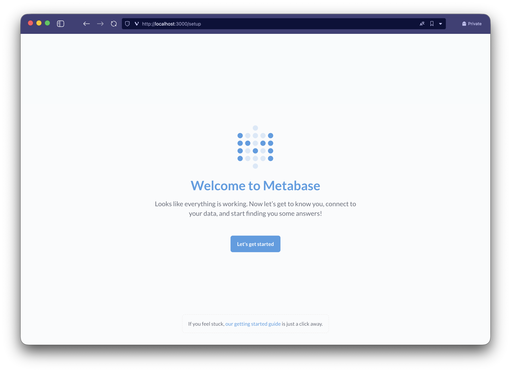

Complete the initial wizard by creating the (local) user associated with your temporary Metabase instance. Depending on the version in use, the welcome wizard may ask you to configure the connection directly.

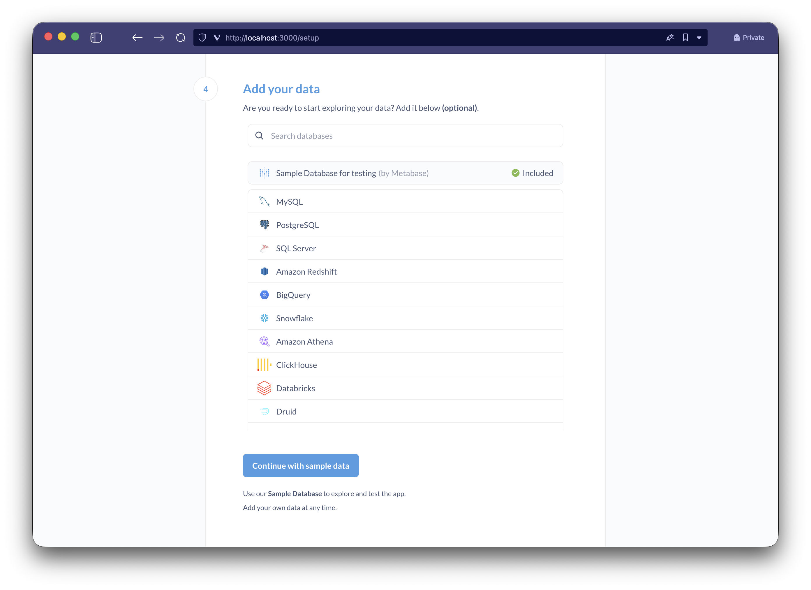

Click on `PostgreSQL` and fill in the following fields

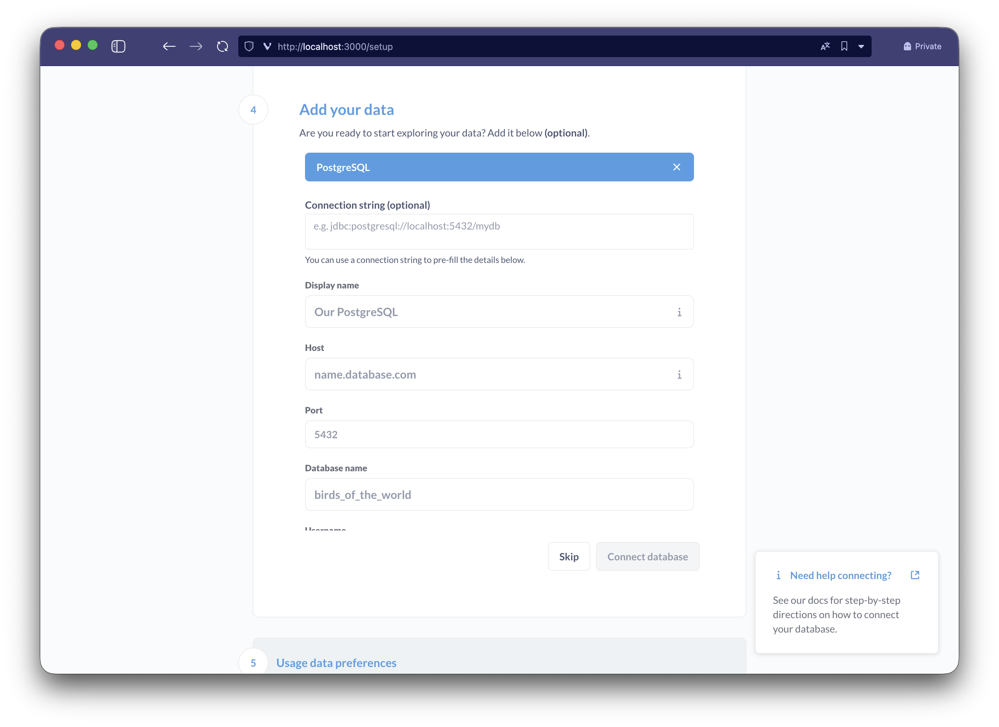

- **Display name**: `BauplanLabs` (you can change this)
- **Hostname**: the hostname of your Bauplan server
- **Port**: the port assigned by your server to the proxy
- **Database name**: the ref or branch name you want to connect to (for example, `main`)
- **Username**: your username
- **Password**: your API Key
- **Use a secure connection (SSL)**: enable
  - SSL Mode: `require`
- Expand `Show advanced options`:
  - **Additional JDBC connection string options**: `preferQueryMode=simple`
- Click on `Connect database` to test the integration

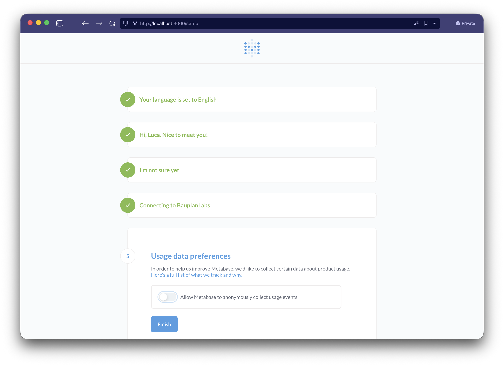

Once setup is complete, press `Finish` to access Metabase with your newly created user.

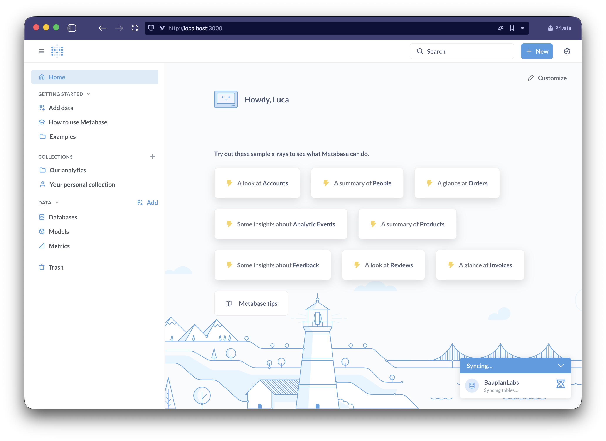

On first login, `Metabase` will begin synchronizing and indexing the list of tables and columns from your data lake; this operation may take a few minutes depending on the number of tables in your instance.

Once synchronization is complete, you can view the list of tables by clicking from the side menu on `Data > Databases > BauplanLabs`.

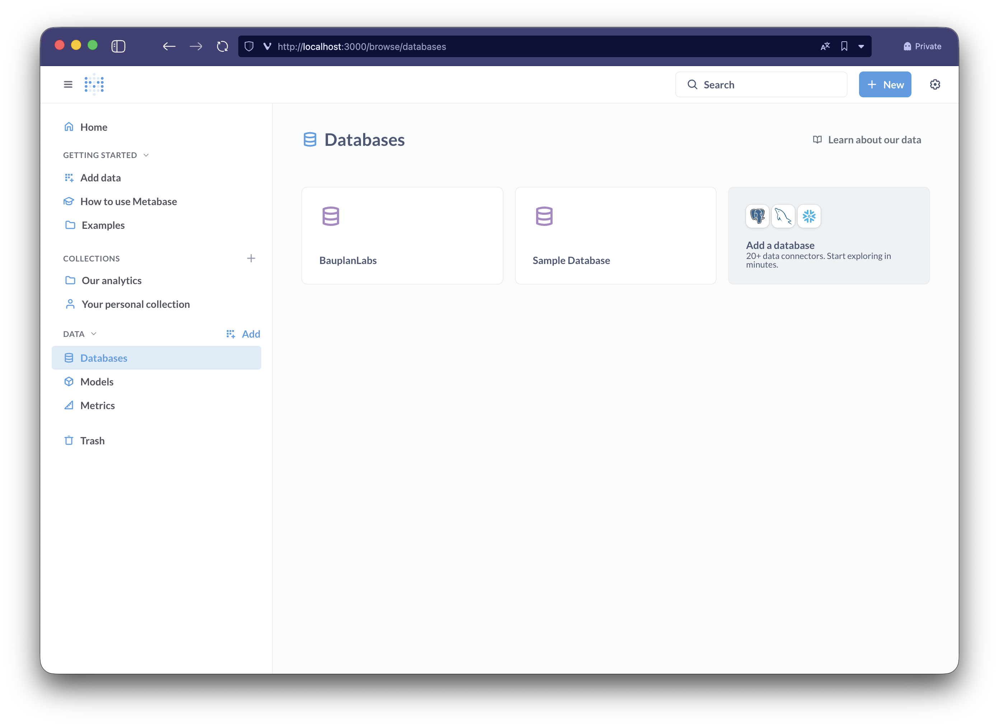

Let's click a table (`Taxi Zones`) to view its content, confirming that the setup was successful.

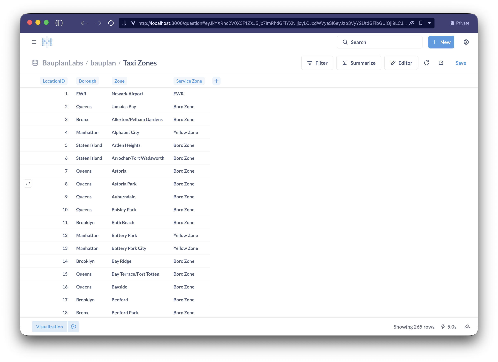

Now let's try building a simple dashboard with Metabase using the `Titanic` dataset; for simplicity, we'll skip configuring or defining custom `Models` and `Metrics` as they're out of scope for the integration.

Click on `Add a chart` and then on `New Question` to create a new widget in guided mode; search for and select `Titanic` from the list of tables, and create a first model with some basic information by gender.

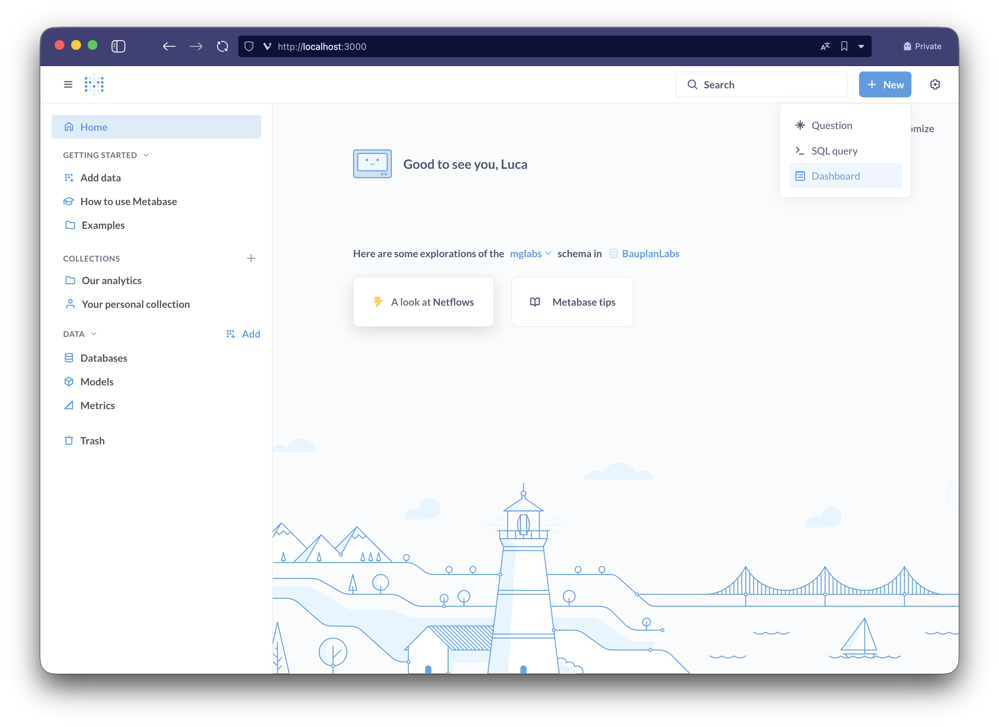

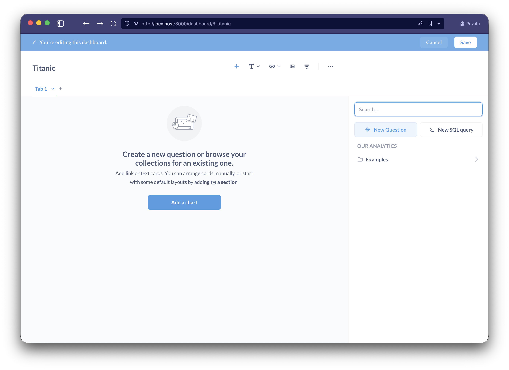

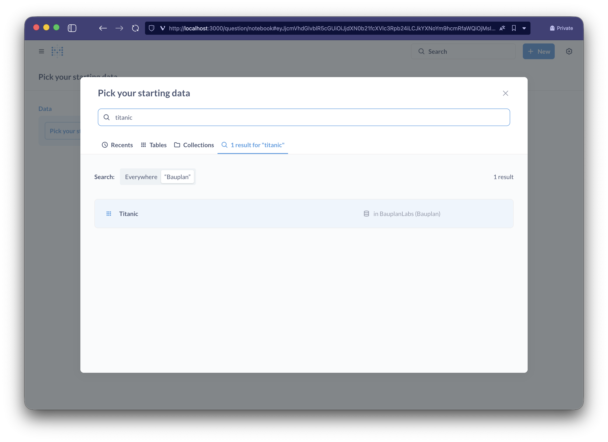

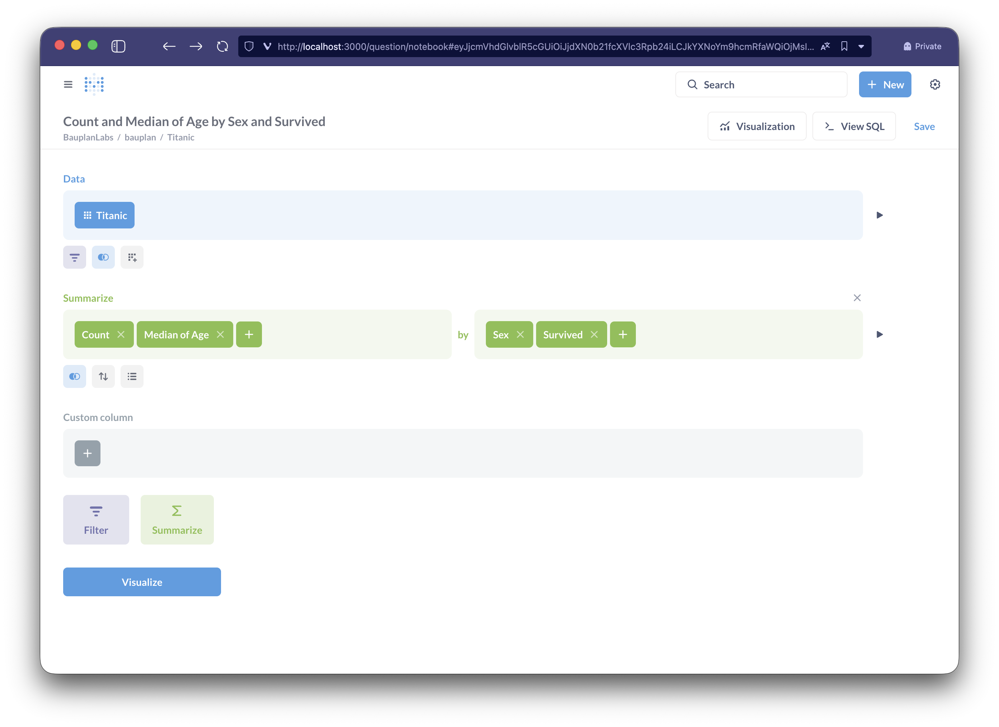

Click on visualize to confirm the correctness of the filters just created, and press `Save` to add the new question to our dashboard.

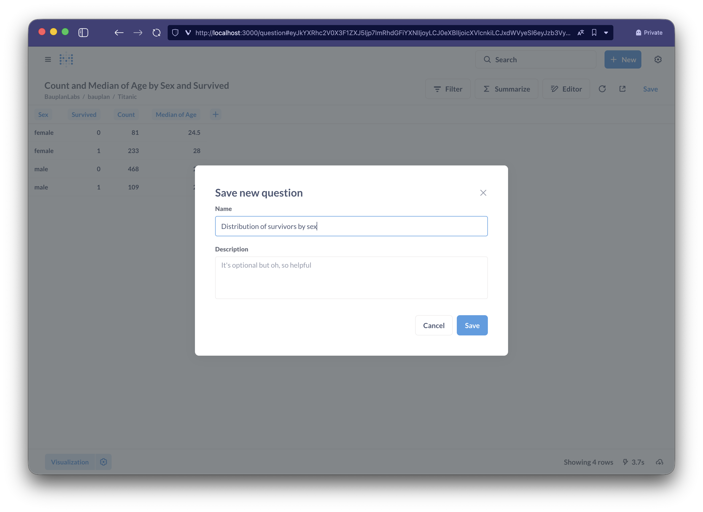

Our dashboard is ready, we can now save it and access it directly from the `Our analytics -> Titanic` section.

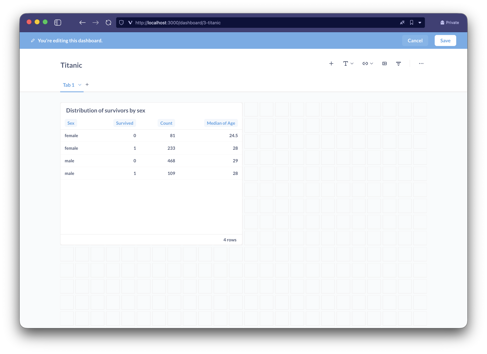

## Advanced configurations

The Bauplan connection configuration is available in the `Admin settings -> Databases` section accessible from the cog icon in the upper right of Metabase.

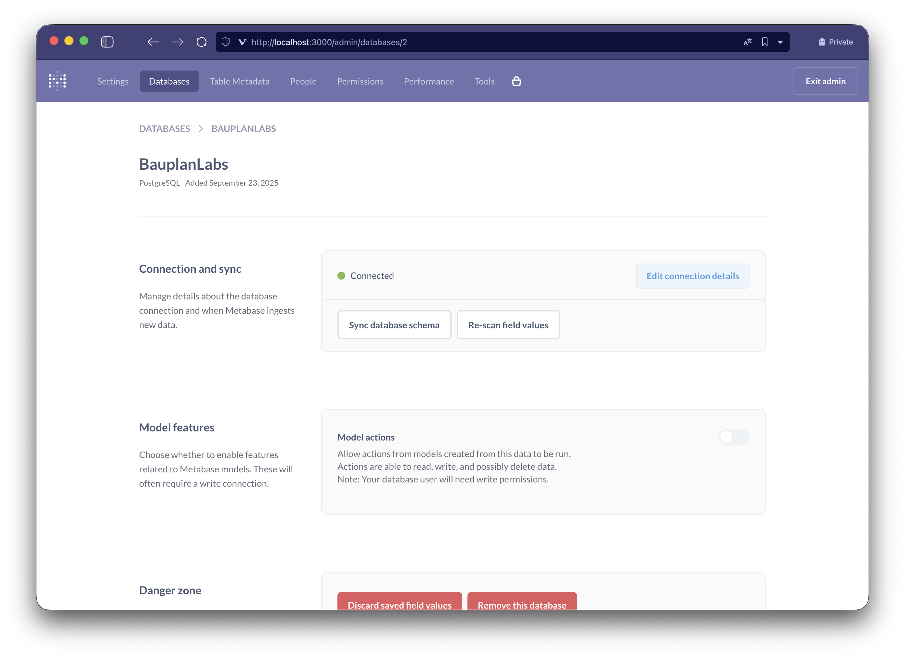

You can configure Metabase to periodically update the list of new tables or fields (`Edit connection details -> Periodically refingerprint tables`) or manually trigger a new synchronization `Sync database schema`.

`Model actions` is not supported by the Proxy, as the lakehouse connection is accessible in Read Only mode.
