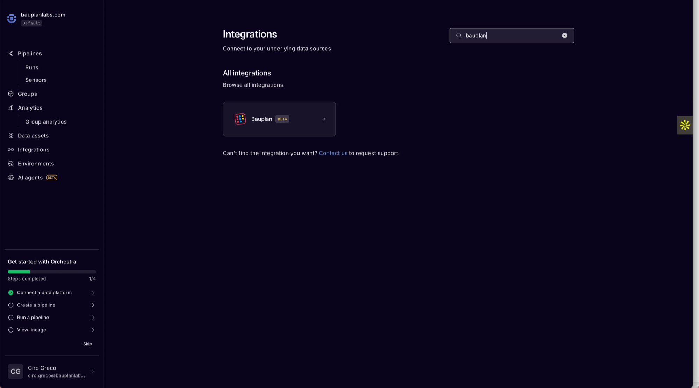
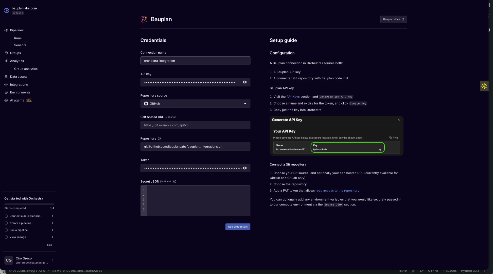
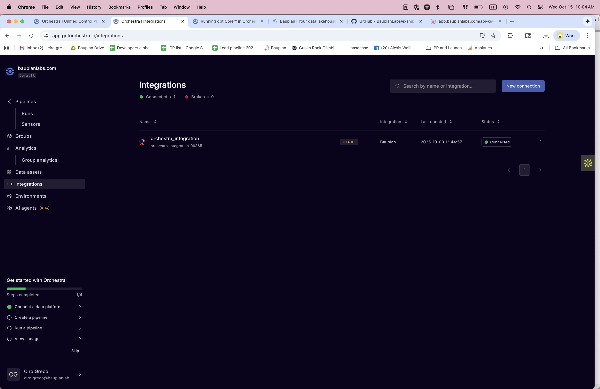
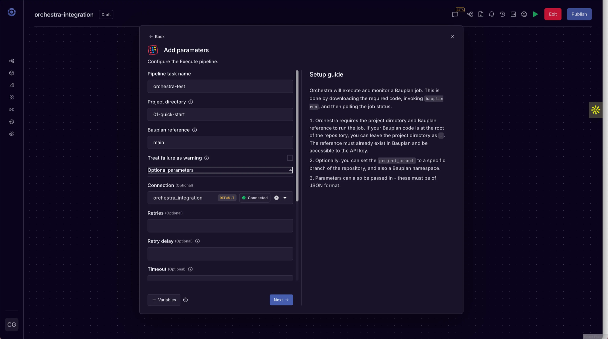
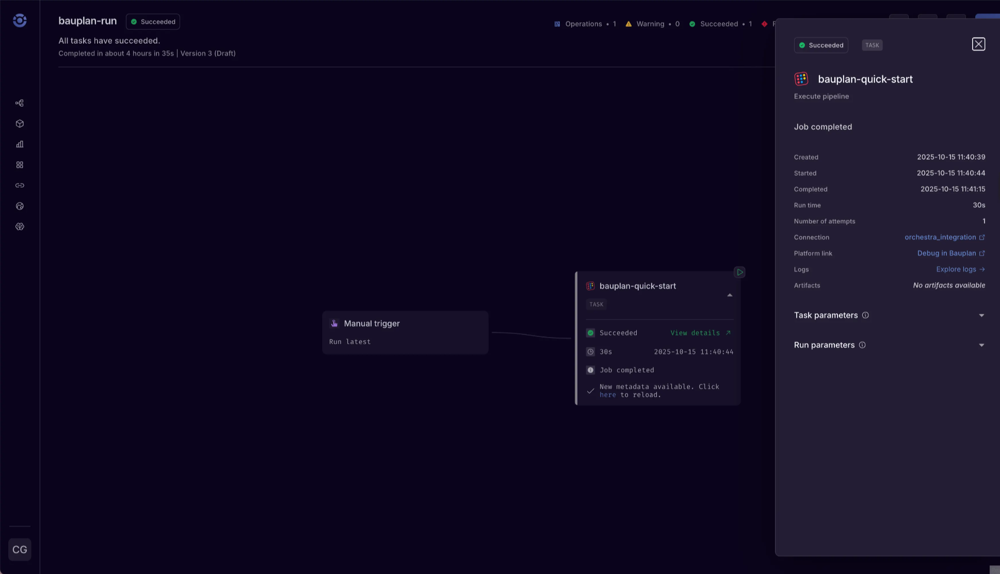

# Orchestra

## Overview

[Orchestra](https://www.getorchestra.io/?utm_source=chatgpt.com) is a managed orchestration platform that lets data teams build, schedule, and monitor pipelines through a simple web interface or declarative YAML.

Orchestra is SaaS-only, config and GUI-driven tool. There are no servers to manage and no local DAG code to deploy. Bauplan integrates natively with Orchestra so you can run and monitor Bauplan pipelines as part of your Orchestra workflows.

This page explains how to connect the two systems and execute Bauplan runs directly from Orchestra tasks.

## Prerequisites

- Python 3.10+ installed.
- A [Bauplan API key](/tutorial/installation) (via environment or passed to the client).
- An [Orchestra account](https://app.getorchestra.io/signup) with pipeline creation privileges.
- A Git repository containing a [Bauplan project](/concepts/projects) (a folder containing your pipeline code and `bauplan_project.yml`)

## Step 1: Create a Bauplan API Key

See the [installation docs.](/tutorial/installation)

## Step 2: Connect Bauplan to Orchestra

In the Orchestra dashboard:

1. In the left bar choose “connect a data platform”, then choose Bauplan from the list:

    

2. Then input your Bauplan API key and follow the instructions to connect your repository with your Bauplan code.

    

    When completed, your integration with Bauplan should appear under **Integrations → Connected** in the Orchestra sidebar.

    

3. (Optional) Add a `Secret JSON` section if you want Orchestra to securely pass environment variables to the runtime, such as:

    ```json
    {
      "BAUPLAN_API_KEY": "your-api-key"
    }
    ```


## Step 3 - run Bauplan operations from Orchestra

Once connected, you can run Bauplan code in Orchestra in two ways:

### 3.1 Native Bauplan tasks

Orchestra provides two built-in operations that run directly on Bauplan and can be configured from the UI:

1. **Bauplan Execute Pipeline**

    Run a Bauplan pipeline (or model) defined in your project and monitor its status inside Orchestra. → See [docs.getorchestra.io/docs/integrations/bauplan/bauplan_execute_pipeline](https://docs.getorchestra.io/docs/integrations/bauplan/bauplan_execute_pipeline)

2. **Bauplan Data Quality Test**

    Trigger Bauplan expectations or validation suites as part of your orchestration flow. → See [docs.getorchestra.io/docs/integrations/bauplan/bauplan_data_quality_test](https://docs.getorchestra.io/docs/integrations/bauplan/bauplan_data_quality_test)


Both tasks are configured visually in Orchestra.

1. Open the Orchestra UI and create a new pipeline.
2. Add a Bauplan task.

    

3. Assign the **Bauplan connection** you created earlier.
4. Optionally configure **parameters**, **schedules**, or **alerts** through Orchestra’s GUI.
5. Save and trigger the pipeline. Upon successful completion you should see this.

    


### 3.2 Custom Python tasks using the Bauplan SDK

For all other Bauplan operations (for example, `query()`, `create_branch()`, `create_table()`, `merge_branch()`, etc.), use Orchestra's **Python integration** to run custom scripts.

- Integration reference:

    [Python Integration](https://docs.getorchestra.io/docs/integrations/python/)

    [Python Execute Script Task](https://docs.getorchestra.io/docs/integrations/python/python_execute_script)


Each task executes a Python file from your repository within Orchestra's managed runtime.

Inside the script, you can call the Bauplan Python SDK as you would locally.

Example:

```python
import bauplan
import pandas as pd

def run_query_with_bauplan(query: str, ref: str):
    client = bauplan.Client()

    df = client.query(query=query, ref=ref).to_pandas()
    print(df.head())
    return df


def main():
    query = "SELECT * FROM titanic LIMIT 10"
    branch = "main"
    df = run_query_with_bauplan(query=query, ref=branch)
    df.show()

if __name__ == "__main__":
    main()
```

Add this file to your repository and point an Orchestra **Python Execute Script** task to it.

Logs will stream back to the Orchestra UI.
