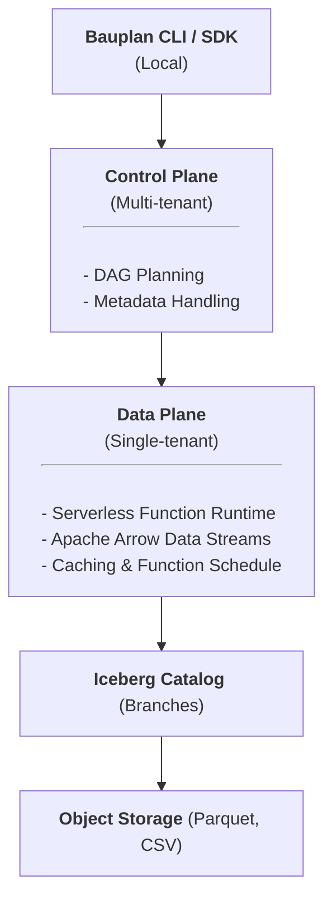

Bauplan\'s architecture is organized around three main layers:

## Control Plane (Multi-tenant)

The **Control Plane** is Bauplan\'s central management layer, shared
across tenants. It handles metadata, planning, and orchestration. No
user data ever reaches this layer.

-   **Code Parsing and Planning:** Analyzes Python decorators and SQL
    statements to build a logical DAG of functions and package
    dependencies.
-   **Metadata Resolution:** Uses the Iceberg catalog to determine the
    exact state of tables, branches, and commits necessary for
    execution.
-   **Plan Compilation:** Generates an optimized physical execution
    plan, specifying exactly how functions will run and communicate.

## Data Plane (Managed or BYOC)

The **Data Plane** executes your functions securely and efficiently
within isolated, tenant-specific environments.

-   **Serverless Runtime:** Spins up ephemeral containers for each
    function invocation, optimized for fast startup and minimal
    overhead.
-   **Data Movement:** Shares data between functions through zero-copy
    Arrow tables (within hosts) or over high-performance Arrow Flight
    (across hosts).
-   **Scheduling and Caching:** Dynamically schedules functions to
    maximize resource usage and caches results to accelerate repeated
    data accesses.

## Storage Layer (User-owned)

Bauplan interacts directly with your existing object storage, ensuring
you retain full control of your data.

-   **Open Formats:** Uses open standards (Parquet) to store data in
    your own S3 or compatible buckets.
-   **Iceberg Tables and Branching:** Organizes data into Iceberg tables
    with Git-like branches, enabling safe experimentation and reliable
    CI/CD workflows.
-   **Immutable Metadata:** Tracks all operations through an Iceberg
    catalog, ensuring versioning, reproducibility, and full
    auditability.

### Architectural Flow

The diagram below illustrates the flow from local development to
execution and data storage:

