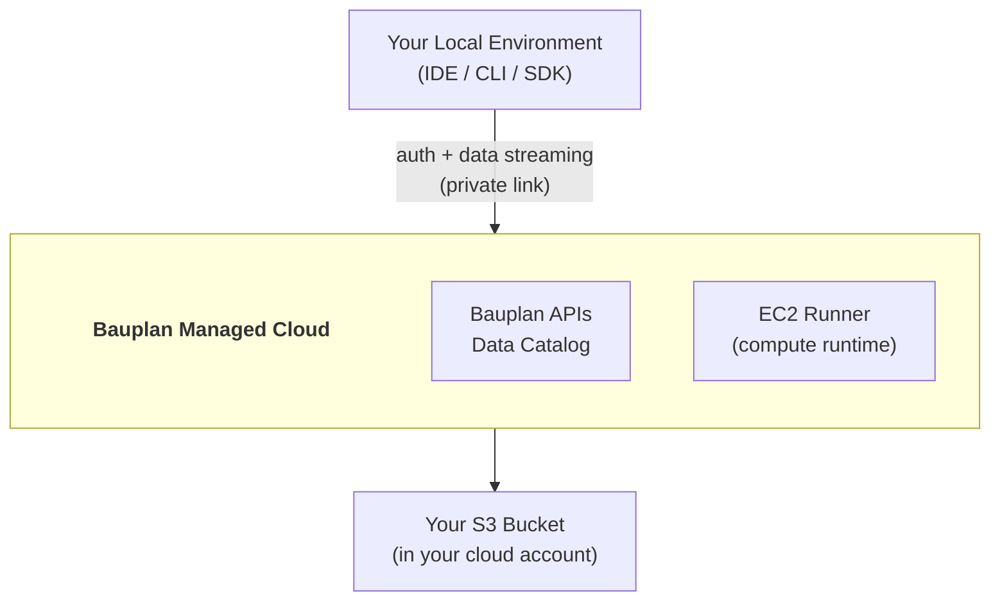
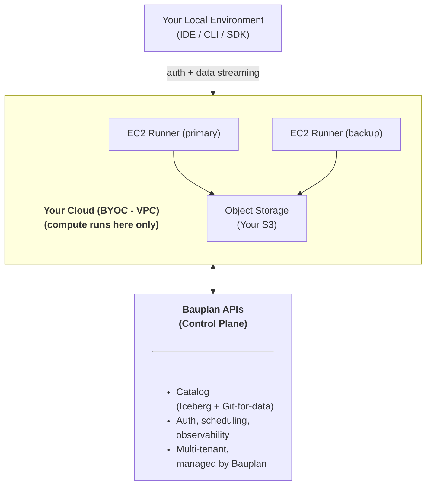

Bauplan offers two secure deployment options tailored to your needs.

## Single-tenant Private Link Deployment

In this model, Bauplan manages a dedicated cloud environment for you,
linked to your own object storage:

Key Benefits:

-   Fully isolated, SOC2-compliant managed environment.
-   Data stays in your cloud with no S3 egress costs.
-   No infrastructure management required by your team.

## Bring Your Own Cloud (BYOC) Deployment

In the BYOC model, the entire Bauplan runtime is deployed within your
existing VPC, under your control:

Key Benefits:

-   Maximum security and control within your infrastructure.
-   No external data traffic, fully private and compliant.
-   Efficient, with zero data transfer costs to external networks.
