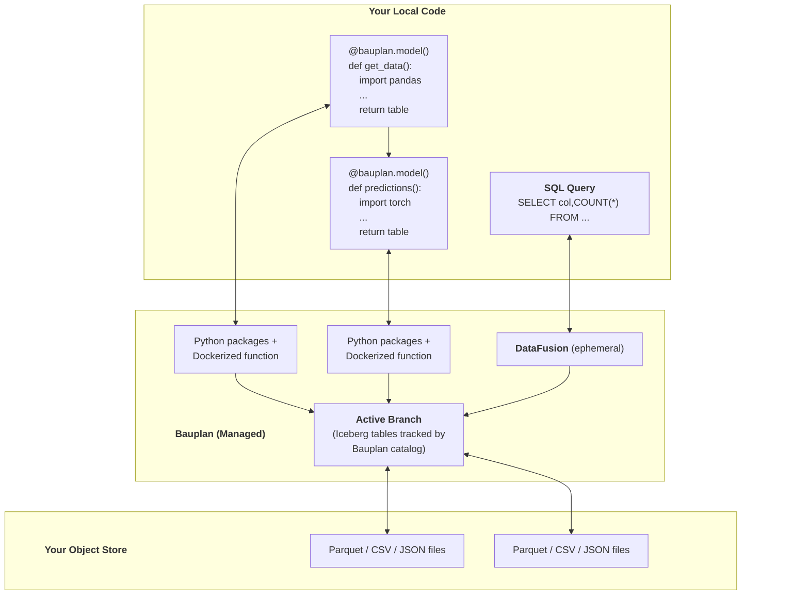

When you run a function or a pipeline in Bauplan, here\'s what happens
behind the scenes:

-   **You write code locally in your IDE and you run it remotely** using
    the Bauplan SDK and CLI. When you run `bauplan run`, the
    platform handles everything else (environment setup, execution,
    data movement, and tracking).
-   **Your code is packaged and executed in Bauplan\'s managed
    runtime**, built on a fast, secure, and autoscaling
    Function-as-a-Service (FaaS) layer. All functions are ephemeral.
-   **Your data is persisted only in your cloud.** Bauplan reads and
    writes directly from your S3. Bauplan doesn\'t copy or ingest your data.
-   **Results and metadata are versioned.** Every operation that results
    in writing to the data catalog (such as a run) creates a new immutable
    reference (Ref) capturing the code, inputs, outputs, and
    environment. This enables full reproducibility, auditability, and
    rollback.

