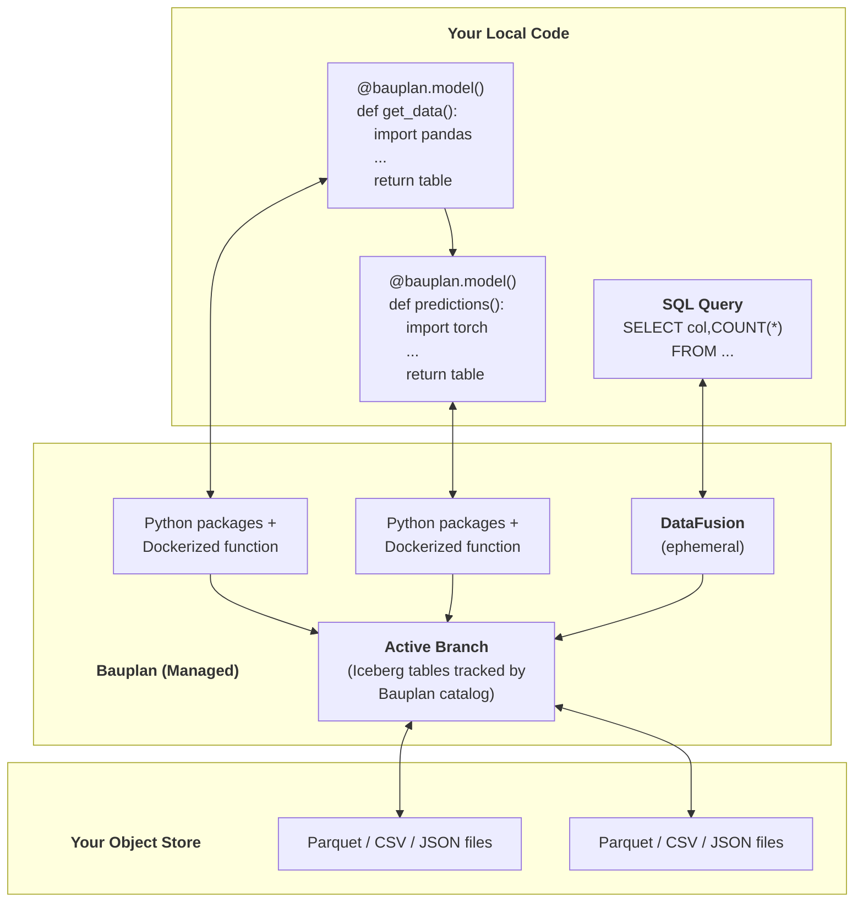

When you run a function or a pipeline in Bauplan, here\'s what happens
behind the scenes:

- **You write code locally in your IDE and you run it remotely** using
  the Bauplan SDK and CLI. When you run `bauplan run`, the
  platform handles environment setup, execution, data movement, and tracking.
- **Bauplan packages and executes your code in its managed runtime**,
  built on a fast, secure, and autoscaling Function-as-a-Service layer.
  All functions are ephemeral.
- **Your data persists only in your cloud.** Bauplan reads and
  writes directly from your S3. Bauplan doesn\'t copy or ingest your data.
- **Bauplan versions results and metadata.** Every operation that writes
  to the data catalog, such as a run, creates a new immutable
  ref that captures the code, inputs, outputs, and
  environment. This enables full reproducibility, auditability, and
  rollback.

```mermaid
%%{init: {'flowchart': {'subGraphTitleMargin': {'top': 16, 'bottom': 16}}}}%%
graph TB
    classDef title fill:none,stroke:none
    classDef code text-align:left

    subgraph local["<b>Your Local Code</b>"]
        getData["@bauplan.model()<br/>def get_data():<br/>&nbsp;&nbsp;&nbsp;&nbsp;import pandas<br/>&nbsp;&nbsp;&nbsp;&nbsp;...<br/>&nbsp;&nbsp;&nbsp;&nbsp;return table"]:::code
        predictions["@bauplan.model()<br/>def predictions():<br/>&nbsp;&nbsp;&nbsp;&nbsp;import torch<br/>&nbsp;&nbsp;&nbsp;&nbsp;...<br/>&nbsp;&nbsp;&nbsp;&nbsp;return table"]:::code
        sqlQuery["<b>SQL Query</b><br/>SELECT col,COUNT(*)<br/>FROM ..."]
        getData --> predictions
    end

    %% The two lower boxes use a text node as their title, so arrows don't cross it.
    subgraph bauplan[" "]
        bauplanTitle["<b>Bauplan (Managed)</b>"]:::title
        pythonRuntime1["Python packages +<br/>Dockerized function"]
        pythonRuntime2["Python packages +<br/>Dockerized function"]
        dataFusion["<b>DataFusion</b><br/>(ephemeral)"]
        activeBranch["<b>Active Branch</b><br/>(Iceberg tables tracked by<br/>Bauplan catalog)"]
    end

    subgraph storage[" "]
        storageTitle["<b>Your Object Store</b>"]:::title
        files1["Parquet / CSV / JSON files"]
        files2["Parquet / CSV / JSON files"]
    end

    getData <--> pythonRuntime1
    predictions <--> pythonRuntime2
    sqlQuery <--> dataFusion

    pythonRuntime1 --> activeBranch
    pythonRuntime2 --> activeBranch
    dataFusion --> activeBranch

    activeBranch <--> files1
    activeBranch <--> files2
```

