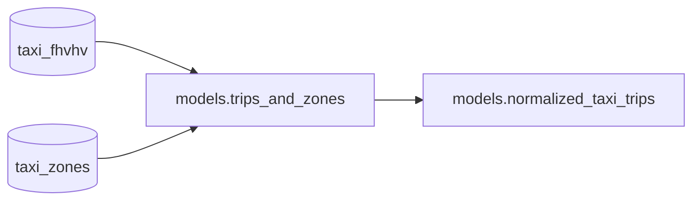

This guide walks you through using Bauplan with the CLI and Python SDK. If you prefer working with AI assistants like Claude Code or Cursor, see the [LLM Quick Start](/llms/quick_start) instead.

These are the only things you need to do:

-   Clone [this repo](https://github.com/BauplanLabs/examples).
-   [Install](/tutorial/installation) bauplan.

<Note>
**Attention:** Bauplan requires Python 3.10 or higher. Make sure you have a compatible Python version installed before proceeding.
</Note>

## Explore the data catalog

Bauplan sandbox comes with pre-loaded public datasets, so you can start
by looking at the data catalog using the CLI. This command will show you
the tables in the main [branch](/concepts/git_for_data/data_branches)
in the data lake.

```sh
bauplan branch get main
```

We can then explore the schema of the tables in the data catalog. The
important tables for this tutorial are `taxi_fhvhv` and `taxi_zones`
(explore our datasets [here](/datasets)).
Here `bauplan` corresponds to the default
[namespace](/concepts/namespaces).

```sh
bauplan table get taxi_fhvhv
bauplan table get taxi_zones
```

## Run a query

You can query the data directly in the data lake using the CLI:

```sh
bauplan query "SELECT max(tips) FROM taxi_fhvhv WHERE pickup_datetime = '2023-01-01T00:00:00-05:00'"
```

The results will be visualized in your terminal (you can use different
interfaces than the CLI by embedding our SDK).

## Run a pipeline

Go into the folder `quick_start`, and run our demo pipeline. For now, we
don\'t have to write any new table in the data lake, so we will just run
in-memory (dry-run).

```sh
cd 01-quick-start
bauplan run --dry-run
```

👏👏 Congratulations, you just ran your first bauplan pipeline! In this
example, you ran a very simple pipeline composed of two Python
functions:



What just happened? When you do `bauplan run` this is what happens:

- Bauplan parses the code in your local file `models.py`, packages and executed in our cloud managed runtime.
- Bauplan builds a logical plan for a DAG based on the implicit dependencies between the nodes
- The nodes of the pipeline are executed as ephemeral isolated functions, while streaming back in real time in your terminal.

In this case, because you ran this pipeline in memory by adding the flag
`--dry-run` no data has been written back into the data lake. For more
information, take a look at Bauplan's
[execution model](../overview/execution_model.mdx)
