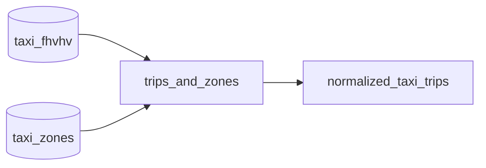

In this guide, we will explain how to set up a bauplan project and run a
pipeline.

## Organizing projects

Pipelines are organized into folders, each of which must contain a
`bauplan_project.yml` file with:

-   a unique `project id`,
-   a `project name`,

```yaml
project:
    id: 40d21649-a47h-437b-09hn-plm75edc1bn
    name: quick_start
```

<Note>
For information about managing sensitive information in your projects,
see [Managing Secrets](/guides/secrets). For the best
practices in organizing Bauplan projects, see [here](/concepts/projects).
</Note>

Ensure you are in the `01-quick_start` folder, which contains a simple
pipeline composed of two functions.



To run a Bauplan pipeline, execute `bauplan run` in your terminal from
the pipeline folder. For now, we will continue running in memory
(details below).

While the pipeline runs remotely, you can monitor its progress in
real-time through the terminal. Any print statements in your code will
appear directly in the terminal, which is very useful during
development.

To see a preview of the pipeline\'s tables in the terminal, add
`--preview head`:

```sh
bauplan run --dry-run --preview head
```

## Bauplan models

The pipeline begins with two tables from the data lake: `taxi_fhvhv` and
`taxi_zones`. The subsequent nodes, called "models," are expressed as
Python functions (we will explore combining Python and SQL later). To
designate a Python function as a model, we use the `@bauplan.model()`
decorator.

Examine the code in `models.py`:

-   The first model, `trips_and_zones`, takes `taxi_fhvhv` and
    `taxi_zones` as input and joins them on `PULocationID` and
    `DOLocationID`.
-   The second model, `normalized_taxi_trips`, takes the output table
    from the previous model, performs data cleaning and normalization
    using Pandas, and returns a final table.

The relationship between the nodes is expressed through naming
conventions by passing the first model as an input argument to the
second in the code: the model `trips_and_zones` serves as input for
`normalized_taxi_trips`.

<Tip>
Models in Bauplan are functions that transform tabular objects into
tabular objects. They should not be confused with ML models.
</Tip>

## Python environments

Python functions often require packages and libraries. For example, the
`normalized_taxi_trips` function requires `pandas 2.2.0`. Bauplan allows
you to express environments and dependencies entirely in code,
eliminating the need to build and upload containers for each change. You
can specify Python environments and dependencies using the
`@bauplan.python()` decorator. Functions in a pipeline are fully
containerized in Bauplan. This means each function can have its own
dependencies without concerns about environment consistency. For
example, to change the Pandas version required by
`normalized_taxi_trips` from `2.2.0` to `1.5.3`, simply modify the
decorator:

```python type:ignore
@bauplan.python('3.11', pip={'pandas': '1.5.3', 'numpy': '1.23.2'})
```

Run the pipeline again, and the system will handle all necessary
adjustments.

## Materialization

Data pipelines create new tables that can be used downstream by other
people and systems. With Bauplan, you can create new tables in your data
lake in any branch of your data catalog by running a pipeline in a
target branch. To specify which tables should be materialized in the
data catalog, use the `materialization_strategy` flag in the
`@bauplan.model()` decorator. By default (when not set), artifacts will
not be materialized. When set to `REPLACE`, the decorated model's
output will be materialized as an Iceberg table in the data catalog. In
`models.py`, set the `materialization_strategy` flag for the
`normalize_taxi_trips` model to `REPLACE`:

```python
@bauplan.model(materialization_strategy='REPLACE')  # Other options are 'NONE', 'APPEND', or 'OVERWRITE_PARTITIONS'
#! @bauplan.python('3.11')
#! def my_model():
#!     ...
```

Then checkout to your `hello_bauplan` branch and run the pipeline:

```sh
bauplan checkout <YOUR_USERNAME>.hello_bauplan
bauplan run
```

👏👏 Congratulations, you just created a new table by running a
pipeline!

The table `normalize_taxi_trip` was materialized in your branch. You can
now inspect the table, query it.

```sh
bauplan table get normalize_taxi_trip
bauplan query "SELECT * FROM normalize_taxi_trip LIMIT 5"
```

For an extensive explanation of Bauplan models see [models](/concepts/models).

## In-memory Execution and `--dry-run`

To iterate quickly in your terminal, we suggest you run your pipelines
in memory. This approach significantly accelerates execution since the
system doesn\'t need to write tables in object storage at each run. To
run in memory you can simply set the `materialization_strategy` flag to
`NONE`.

Alternatively, you can use the flag `--dry-run` with `bauplan run`. This
flag will run in memory even when your models have
`materialization_strategy` set to `REPLACE`, `APPEND`, or `OVERWRITE_PARTITIONS`. Moreover,
`--dry-run` will allow you to run pipelines directly in the `main`
branch (since by default materialization in `main` is not permitted).

<Note>
-   Materialization is not allowed in the `main` branch
-   Always use `--dry-run` when working in the `main` branch to avoid
    errors
</Note>

This concludes our introductory tutorial to Bauplan. You should now
understand the platform's core functions, including data branching,
running, and querying. For more advanced capabilities and information
about using our platform within your stack via our Python SDK, explore
our [examples](/examples) section.
