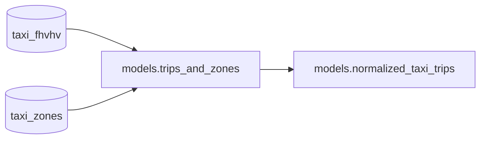

# Pipeline to dashboard

Build a data pipeline over NYC taxi data and connect it to an interactive Streamlit dashboard. This is a good starting point if you're new to Bauplan.

## The pipeline

The pipeline processes NYC taxi trip data from December 2022 and is composed of two models:

- `trips_and_zones`: reads raw trip data from `taxi_fhvhv` and joins it with `taxi_zones` on `PULocationID` to enrich each trip with Borough and Zone information. Uses [PyArrow](https://arrow.apache.org/docs/index.html).
- `normalized_taxi_trips`: takes the joined data, filters out invalid trips (zero or unrealistic trip miles), and adds a `log_trip_miles` column for visualization. Uses [Polars](https://pola.rs/). This model is materialized as an [Iceberg table](https://iceberg.apache.org/).



## Running the pipeline

```sh
# Create the branch and switch to it in one command
bauplan checkout -b <YOUR_USERNAME>.pipeline_to_dashboard

bauplan run --project-dir pipeline
```

## The dashboard

The Streamlit app in `app/viz_app.py` queries the `normalized_taxi_trips` table from your branch and displays three views:

- **Trips by Zone**: bar chart of the top 30 pickup zones by trip count
- **Trip Miles Distribution**: histogram of log10(trip miles)
- **Fare vs Miles**: scatter plot of base fare against trip miles

Run it with:

```sh
uv run streamlit run app/viz_app.py -- --branch <YOUR_USERNAME>.pipeline_to_dashboard
```

> **Note:** The dataset is fairly large, so the dashboard may take a moment to load on first launch.

## Key takeaways

- Bauplan pipelines can chain multiple models and materialize the result as a production Iceberg table in a single run
- You can mix data libraries in the same DAG - PyArrow for the join, Polars for the transformation
- Any Python process can query Bauplan tables via the SDK, so connecting a Streamlit dashboard (or any app) to your pipeline output is a few lines of code
- Branches let you develop and test against real data without touching production
