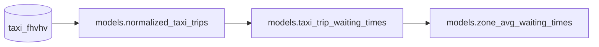

# Data Quality and Expectations

Add expectation tests to a Bauplan pipeline to catch data quality issues before they reach production. Expectation tests are statistical and quality checks applied to Bauplan models - they help detect problems early and can halt the pipeline when critical issues are found.

## The pipeline

The pipeline computes average taxi waiting times for NYC neighborhoods, using [Polars](https://docs.pola.rs/) for data processing:

- `normalized_taxi_trips`: joins raw trip data from `taxi_fhvhv` with `taxi_zones` to enrich each trip with Borough and Zone information.
- `taxi_trip_waiting_times`: calculates the time in minutes between calling a cab and its arrival for each row.
- `zone_avg_waiting_times`: computes average waiting times aggregated by Borough and Zone, ordered by longest wait first.



## The expectation test

The file `expectations.py` contains an expectation test using `bauplan.standard_expectations`. Bauplan's library comes with standard tests for common checks (column nulls, uniqueness, mean ranges, etc.). You can also write your own or use libraries like [Great Expectations](https://github.com/great-expectations/great_expectations).

To calculate waiting times, the `on_scene_datetime` column must have no null values. The test uses `expect_column_no_nulls` and halts the pipeline via `assert` if it fails:

```python
import bauplan
from bauplan.standard_expectations import expect_column_no_nulls

@bauplan.expectation()
@bauplan.python('3.11')
def test_null_values_on_scene_datetime(
    data=bauplan.Model('normalized_taxi_trips'),
):
    column_to_check = 'on_scene_datetime'
    _is_expectation_correct = expect_column_no_nulls(data, column_to_check)

    assert _is_expectation_correct, (
        f"expectation test failed: we expected {column_to_check} to have no null values"
    )

    return _is_expectation_correct
```

Halting a pipeline on failure isn't always necessary, but it's important to be notified of potential data quality issues. The flexibility of expectations allows the user to make that decision.

## Try it yourself

Run the pipeline as-is and see what happens:

```sh
bauplan checkout -b <YOUR_USERNAME>.expectations

bauplan run --project-dir pipeline
```

The pipeline will succeed, but the expectation test will fail - notice how the downstream models still run and complete:

```
normalized_taxi_trips done
test_null_values_on_scene_datetime [expectation] failed
taxi_trip_waiting_times done
zone_avg_waiting_times done
```

The expectation flags a data quality issue - there are null values in `on_scene_datetime` - but it doesn't block the rest of the pipeline. If you want to fail the pipeline based on the failed expectation you can add `--strict on` to the CLI command, like so:
```sh
bauplan run --project-dir pipeline --strict on
```

To fix the underlying data issue, open `models.py` and add a filter before line 37 (`return result.to_arrow()`) in `normalized_taxi_trips`:

```python type:ignore
    # drop rows where on_scene_datetime is null
    result = result.filter(pl.col("on_scene_datetime").is_not_null())

    return result.to_arrow()
```

Then re-run the pipeline:

```sh
bauplan run --project-dir pipeline
```

This time the expectation test will pass - no nulls in `on_scene_datetime` - and you can be confident the downstream waiting time calculations are based on clean data.

## Key takeaways

- `@bauplan.expectation()` attaches data quality checks directly to a model - they run as part of the pipeline, not as a separate step
- By default, a failed expectation surfaces the issue without blocking downstream models, so you get visibility without pipeline-wide halts
- When a check is critical, running the pipeline with `--strict on` will fail it immediately
- Expectations are flexible: use built-in checks from `bauplan.standard_expectations`, write your own, or plug in libraries like Great Expectations
