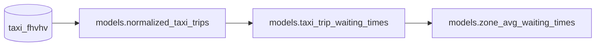

# Data quality and expectations

Add an expectation to a Bauplan pipeline to validate a relationship between columns and control whether a failed check blocks downstream models.

## The pipeline

The pipeline computes average taxi waiting times for NYC neighborhoods using [Polars](https://docs.pola.rs/):

- `normalized_taxi_trips` joins raw trip data from `taxi_fhvhv` with `taxi_zones` to add Borough and Zone information.
- `taxi_trip_waiting_times` calculates the minutes between requesting a cab and the driver's arrival.
- `zone_avg_waiting_times` computes average waiting times by Borough and Zone.


```mermaid
flowchart LR
id0[(taxi_fhvhv)]-->id2[models.normalized_taxi_trips]
id2[models.normalized_taxi_trips] -->
id3[models.taxi_trip_waiting_times]
id3[models.taxi_trip_waiting_times] -->
id4[models.zone_avg_waiting_times]
```

## Type contracts and expectations

The model schema declares `request_datetime` and `on_scene_datetime` as `TimestampMicroUTC | None`. This contract checks each column's type and allows the null values present in the source data.

A type contract cannot express the relationship between the two timestamps. The expectation checks that a non-null `on_scene_datetime` never occurs before its corresponding `request_datetime`. Rows where either timestamp is null are excluded from this comparison.

## The expectation test

The file `expectations.py` contains a custom cross-column consistency check:

```python
from typing import Annotated

import bauplan
import pyarrow as pa

from bauplan import Model, TableSchema, TimestampMicroUTC


class TripTimingColumns(TableSchema):
    """Trip timestamps used to validate event ordering."""

    request_datetime: TimestampMicroUTC | None
    on_scene_datetime: TimestampMicroUTC | None


@bauplan.expectation()
@bauplan.python("3.11")
def test_on_scene_not_before_request(
    data: Annotated[
        pa.Table,
        Model(
            "normalized_taxi_trips",
            projection_schema=TripTimingColumns,
        ),
    ],
) -> bool:
    """Validate that driver arrival does not precede the ride request."""
    import pyarrow.compute as pc

    reversed_timestamps = pc.field("on_scene_datetime") < pc.field("request_datetime")
    violation_count = data.filter(reversed_timestamps).num_rows
    is_order_valid = violation_count == 0

    assert is_order_valid, (
        f"expectation test failed: {violation_count} rows have "
        "on_scene_datetime before request_datetime"
    )

    return is_order_valid
```

## Try it yourself

Create a data branch and disable strict mode to observe a failed expectation without failing the run:

```sh
bauplan checkout -b <YOUR_USERNAME>.expectations

bauplan run --project-dir pipeline --no-strict
```

The expectation fails, but the downstream models continue:

```text
normalized_taxi_trips done
test_on_scene_not_before_request [expectation] failed
taxi_trip_waiting_times done
zone_avg_waiting_times done
```

Strict mode is enabled by default. Run the pipeline without `--no-strict` to make the failed expectation block the run:

```sh
bauplan run --project-dir pipeline
```

## Fix the data issue

Filter rows with reversed non-null timestamps in `normalized_taxi_trips`, while preserving rows whose timestamps are null:

```python type:ignore
result = result.filter(
    pl.col("on_scene_datetime").is_null()
    | pl.col("request_datetime").is_null()
    | (pl.col("on_scene_datetime") >= pl.col("request_datetime"))
)

return result.to_arrow()
```

Run the pipeline again:

```sh
bauplan run --project-dir pipeline
```

The expectation now passes because every pair of comparable timestamps is correctly ordered.

## Key takeaways

- Type contracts validate table shape, column types, and declared nullability.
- Expectations validate data properties and relationships that types cannot express.
- Strict mode is enabled by default and blocks the run when an expectation fails.
- `--no-strict` reports failed expectations while allowing downstream models to run.
