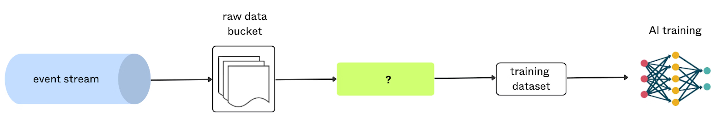
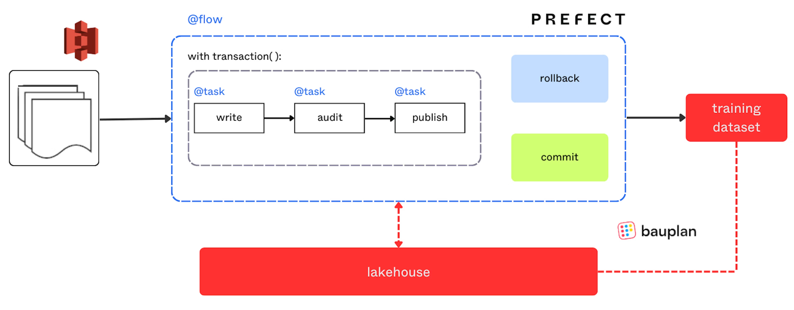
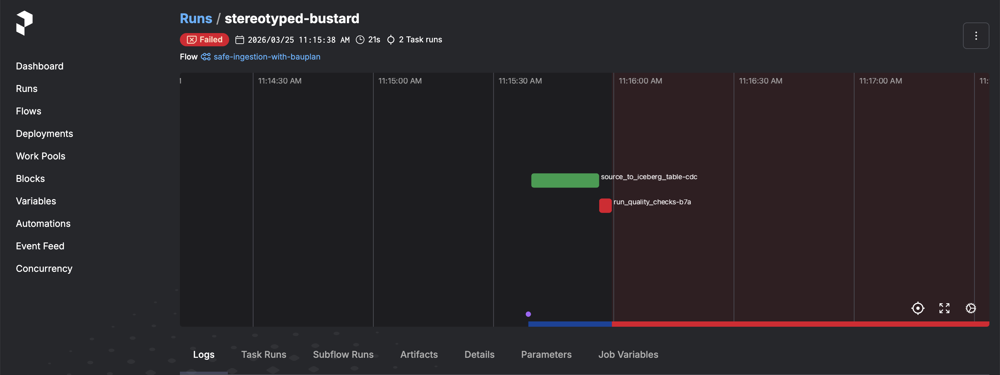

# Safe Ingestion with Bauplan and Prefect

Implement the Write-Audit-Publish (WAP) pattern using [Prefect](https://www.prefect.io/) and Bauplan to safely ingest data into the lakehouse on a recurring schedule.

This example is implemented using Prefect, for other orchestration tools (like Airflow or Temporal) see our integration guide - https://docs.bauplanlabs.com/integrations/orchestrators/

## Overview

A common need on S3-backed analytics systems is safely ingesting new data into tables available to downstream consumers. Due to their distributed nature, lakehouse ingestion is more delicate than the equivalent operation on a traditional database.



The WAP pattern consists of three steps:

* **Write**: ingest data into a staging branch - not yet visible to downstream consumers.
* **Audit**: run quality checks on the data to verify integrity.
* **Publish**: if checks pass, merge to main (making data visible); otherwise, raise an error and clean up.

This example implements WAP in ~150 lines of pure Python using [Prefect transactions](https://docs.prefect.io/v3/advanced/transactions#how-to-write-transactional-workflows) as the outer layer for task handling and Bauplan branches as the inner layer for data isolation.

* [Blog post](https://www.prefect.io/blog/prefect-on-the-lakehouse-write-audit-publish-pattern-with-bauplan) - longer discussion on context and trade-offs
* [Demo video](https://www.loom.com/share/0387703f204e4b3680b1cb14302a04da?sid=536f3a9f-c590-4548-a3c2-b5861b8c17c0) - quick walkthrough of the developer experience



## Additional setup

This example requires [Prefect](https://www.prefect.io/). Install all dependencies with:

```sh
uv sync
```

### Dataset

The data checks assume you are ingesting the Titanic dataset, available [here](https://raw.githubusercontent.com/datasciencedojo/datasets/refs/heads/master/titanic.csv). Load the CSV into an S3 bucket with public read and list access so that the Bauplan sandbox can reach it. To use a different dataset, adjust the column name in `safe_ingestion_flow.py`.

## Run

Start a local Prefect server:

```sh
uv run python -m prefect config set PREFECT_API_URL=http://127.0.0.1:4200/api
uv run python -m prefect server start
```

Then, in a separate terminal, run the flow:

```sh
uv run python safe_ingestion_flow.py
```

You'll probably see a big scary stack trace - the flow will fail with `AssertionError: Quality check failed`. The Titanic dataset contains nulls in the `Age` column, so the quality check rejects the data. That's the WAP pattern at work: the audit step catches bad data, the flow fails, and the Prefect rollback hook automatically deletes the ingestion branch. No bad data reaches `main`.

Through the Prefect UI at [http://localhost:4200](http://localhost:4200), you can visualize the flow and inspect each run:



## Key takeaways

- Bauplan branches act as a native isolation layer for the WAP pattern - data lands on a temporary branch, gets validated, and only reaches `main` if checks pass
- The Bauplan SDK handles namespace creation, table creation, and S3 imports in pure Python
- Quality checks run against Arrow tables via `bauplan_client.scan()`, so validation logic is plain Python
- Prefect transactions with rollback and commit hooks keep branch cleanup automatic, whether the flow succeeds or fails
- Unique branch names per run (`username.ingestion_timestamp`) make concurrent ingestions safe by default

For the full story on why WAP matters on the lakehouse and the design trade-offs behind this two-layer transaction model, the [companion blog post](https://www.prefect.io/blog/prefect-on-the-lakehouse-write-audit-publish-pattern-with-bauplan) is worth the read.
