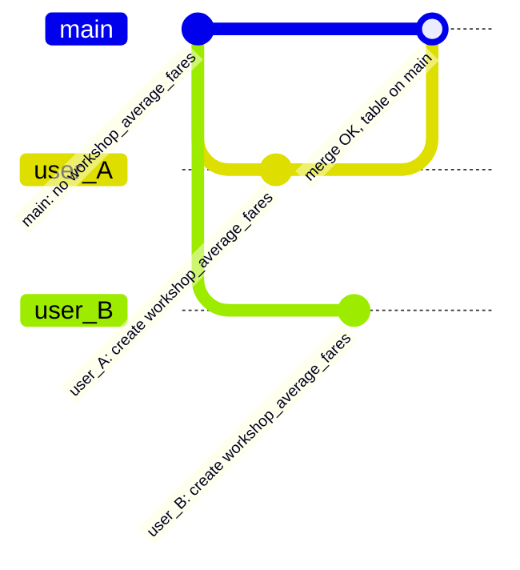

# Concurrency conflict

Demonstrates the conflict that occurs when two users independently materialise the same table and race to publish it on `main`.

User A and user B both branch off `main` when `workshop_average_fares` does not exist and run the same pipeline in isolation. User A merges first, publishing the table on `main`. When user B then tries to merge, Bauplan rejects the merge because `main` has moved on since user B branched.

## Scenario



`user_B` now tries to merge into `main`, but Bauplan rejects it: both `main` and `user_B` independently introduce `workshop_average_fares` from different histories, so Bauplan cannot reconcile the merge automatically.

## Pipelines

| Pipeline | Source table | Groups by | Computes |
|---|---|---|---|
| `avg_fare` | `titanic` | `Pclass` | Mean fare per passenger class |

## Usage

```sh
uv run main.py [OPTIONS]
```

Run `uv run main.py --help` to see all available options.

### Options

| Option | Default | Description |
|---|---|---|
| `--profile` | `default` | Bauplan profile to use. |

### Expected output

```
User A opened branch <USER>.user_A
User B opened branch <USER>.user_B
User A pipeline succeeded on <USER>.user_A
User B pipeline succeeded on <USER>.user_B
User A merged into main
User B failed to merge into main, as expected. Error: (409, 'MERGE_CONFLICT', 'Merge conflict between source branch "<USER>.user_B" and destination branch "<USER>.main": The following keys have been changed in conflict: \'bauplan.workshop_average_fares\'', <bauplan.exceptions.ApiErrorKind.MergeConflict object at 0x103d92430>)
```

## What to observe

User A's merge succeeds and Bauplan publishes `workshop_average_fares` on `main`. Bauplan rejects User B's merge with a conflict, so `main` never ends up in an inconsistent state. User B should re-run the pipeline on a fresh branch off the new `main`.

## Why this happens

User A and user B both branch from the same `main` commit, where `workshop_average_fares` does not exist. They each materialise the table on their own branch in parallel. When user A merges, `main` transitions from "no table" to "user A's table" cleanly, because user A's branch history is a straightforward descendant of `main`.

User B, however, branched from the same prior `main` commit. When user B tries to merge, Bauplan sees that both `main` and user B's branch independently introduce `workshop_average_fares` from different branch histories. It cannot reconcile the two, as they are concurrent creations of the same fully qualified name, so it rejects the merge to protect `main`'s history. This is exactly the correct behaviour: when Bauplan detects the race, it asks the second writer to "rebase" rather than silently overwrite the first writer's work.