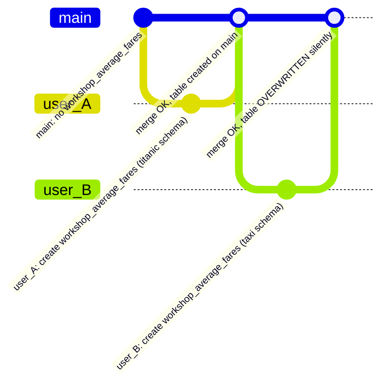
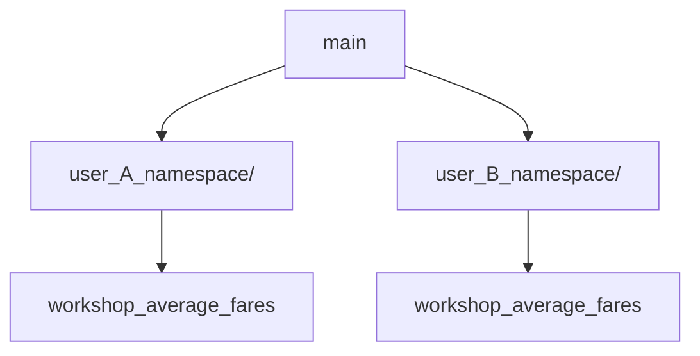

# Naming conflict

Demonstrates the naming conflict that occurs when two pipelines write to the same table name, and how namespace isolation resolves it.

User A and user B each produce a table called `workshop_average_fares` from different source datasets and schemas. The script runs two scenarios back to back.

## Scenarios

**Scenario #1. Same namespace:** both pipelines write to the default namespace. Both merges succeed, but user B silently overwrites user A's table on `main`. User A's schema and data no longer exist at the branch tip. *Note well*: user A's data is not technically gone forever, as Bauplan allows time-traveling: you can always recover the lake state before the user B merge!

**Scenario #2. Different namespaces:** each pipeline writes to a user-specific namespace: `user_A_namespace` and `user_B_namespace`. Both tables coexist on `main` with no overwrite.

### Scenario #1



### Scenario #2

Each pipeline writes into its own namespace, which behaves like a directory. After both merges, `main` contains two separate "directories," each holding its own `workshop_average_fares`: same table name, different fully qualified path, no collision.



## Pipelines

| Pipeline | Source table | Groups by | Computes |
|---|---|---|---|
| `user_A_pipeline` | `titanic` | `Pclass` | Mean fare per passenger class |
| `user_B_pipeline` | `bauplan.taxi_fhvhv` | `hvfhs_license_num` | Mean base fare per license number, for rides from July 2023 onward |

## Usage

```sh
uv run main.py [OPTIONS]
```

Run `uv run main.py --help` to see all available options.

### Options

| Option | Default | Description |
|---|---|---|
| `--profile` | `default` | Bauplan profile to use. |

### Expected output

```
=== Scenario #1: no namespace; user B's merge silently overwrites user A's table ===

User A starts working...
  -> opened branch <USER>.user_A off main
  -> pipeline succeeded on <USER>.user_A
  -> user A merged into main; workshop_average_fares is now on main

Schema of workshop_average_fares on main after user A's merge (namespace: bauplan):
    Pclass                         long
    Fare                           double

User B starts working (main already contains user A's workshop_average_fares)...
  -> opened branch <USER>.user_B off main
  -> pipeline succeeded on <USER>.user_B
  -> user B merged into main; user A's workshop_average_fares has been silently overwritten

Schema of workshop_average_fares on main after user B's merge (namespace: bauplan):
    hvfhs_license_num              string
    base_passenger_fare            double


=== Scenario #2: per-user namespaces; both tables coexist on main ===

User A starts working...
  -> opened branch <USER>.user_A off main
  -> created namespace user_A_namespace on <USER>.user_A
  -> pipeline succeeded on <USER>.user_A
  -> user A merged into main; workshop_average_fares is now on main

Schema of workshop_average_fares on main after user A's merge (namespace: user_A_namespace):
    Pclass                         long
    Fare                           double

User B starts working (main already contains user A's workshop_average_fares)...
  -> opened branch <USER>.user_B off main
  -> created namespace user_B_namespace on <USER>.user_B
  -> pipeline succeeded on <USER>.user_B
  -> user B merged into main; both tables now coexist on main under separate namespaces

Schema of workshop_average_fares on main after user B's merge (namespace: user_B_namespace):
    hvfhs_license_num              string
    base_passenger_fare            double

```

## What to observe

- After scenario #1, `workshop_average_fares` on `main` reflects *only* user B's schema; user A's write was silently overwritten. 
- After scenario #2, both `user_A_namespace.workshop_average_fares` and `user_B_namespace.workshop_average_fares` exist on `main` independently without clash.

## Why this happens

The core idea behind this example is that Bauplan always resolves a "bare" table name to a fully qualified name following the pattern `<namespace>.<table_name>`. Users are not required to specify a namespace explicitly, because it defaults to `bauplan`: a table named `my_table` is `bauplan.my_table` under the hood. That said, users can always override this default by specifying a different namespace, which controls where Bauplan materializes tables and helps avoid naming conflicts.

### Scenario 1

User A branches off `main` where `workshop_average_fares` does not yet exist, writes the table, and merges. No conflict occurs, and the table lands on `main` with user A's schema. User B then branches off `main` *after* user A's merge, so user B's branch already contains user A's table. User B's pipeline writes to the same fully qualified name (default namespace plus `workshop_average_fares`) replacing it on their branch. When user B merges, Bauplan sees an update to an existing table. Bauplan raises no conflict and applies the merge cleanly, so user B's data silently replaces user A's schema and data on `main`. No error appears since this *is* a legitimate merge.

### Scenario 2

Think of a namespace as a directory. When user A creates `user_A_namespace` on their branch and writes `workshop_average_fares` inside it, the merge into `main` carries the namespace over as well: `main` now has a `user_A_namespace/` "directory" containing the table; check our [app](https://app.bauplanlabs.com/catalog/refs/main) to see for yourself. User B does the same with `user_B_namespace`, which lands on `main` as a separate directory.

Both tables share the name `workshop_average_fares`, but their fully qualified names (`user_A_namespace.workshop_average_fares` and `user_B_namespace.workshop_average_fares`) differ, just like two files with the same name can coexist in different directories. From Bauplan's perspective they are entirely distinct tables, so neither merge overwrites the other and both live on `main` side by side. Namespaces are the idiomatic way to let multiple users or pipelines produce independent outputs without stepping on each other.
