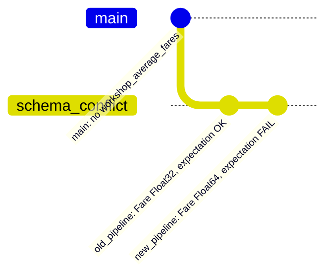

# Schema conflict

Demonstrates how a Bauplan expectation catches a subtle schema drift between two versions of the same pipeline and prevents the drift.

A first, coarse pipeline runs: it computes the mean Titanic fare per passenger class with `Fare` as `Float32`, and carries an expectation that `Fare` must stay `Float32` since downstream dashboards rely on the type. A second, finer-grained pipeline then builds on this to add more detail, grouping by `Pclass` and `Sex` and adding a passenger count. While rewriting, `Fare` accidentally gets cast to `Float64`. Both pipelines run sequentially on the same branch with strict mode on. The expectation fires on the new output, halts the run, and no drift happens.

## Scenario



## Pipelines

| Pipeline | Source table | Groups by | Output columns | Fare type |
|---|---|---|---|---|
| `old_pipeline` | `bauplan.titanic` | `Pclass` | `Pclass`, `Fare` | `Float32` |
| `new_pipeline` | `bauplan.titanic` | `Pclass`, `Sex` | `Pclass`, `Sex`, `Fare`, `n_passengers` | `Float64` (drift) |

Both pipelines ship the same expectation: `Fare` must be `Float32`.

## Usage

```sh
uv run main.py [OPTIONS]
```

Run `uv run main.py --help` to see all available options.

### Options

| Option | Default | Description |
|---|---|---|
| `--profile` | `default` | Bauplan profile to use. |

### Expected output

```
=== Step 1: ship the old pipeline (mean fare per Pclass, Fare: Float32) ===

Old pipeline succeeded; expectation passed (Fare is Float32)
workshop_average_fares is now published

Schema of workshop_average_fares:
    Pclass               long
    Fare                 float

=== Step 2: build the new pipeline (adds Sex, n_passengers; subtle Fare drift) ===

Running the new pipeline...
New pipeline run blocked by the expectation, as expected. Status: JobStatus.failed. Reason: ...

Schema of workshop_average_fares after the new pipeline was blocked:
    Pclass               long
    Fare                 float
```

## What to observe

After the old pipeline runs, `workshop_average_fares` on the branch has `Fare: Float32`. The new pipeline fails on the expectation and Bauplan attempts no merge, not even on the current branch. The transactional branch catches the subtle Float32 → Float64 drift in the new pipeline before it spreads.

## Why this matters

Schema drift rarely arrives as an obvious break. It slips in as a one-token change (in this case, `pl.Float32` becomes `float`, possibly because different engineers implemented it differently) and the pipeline still "works." The output table is still there. Row counts are still right. What changes is the contract with whoever reads the table, and that break surfaces far from where someone introduced it: a dashboard that truncates cents, a join that silently drops rows because the types no longer match, a model that loses precision. Expectations turn that implicit contract into executable code that lives next to the model. 

Because the expectation is part of the pipeline DAG and the pipeline runs with `strict="on"`, it fires automatically after the model materializes and fails the run before the branch reaches a mergeable state.
