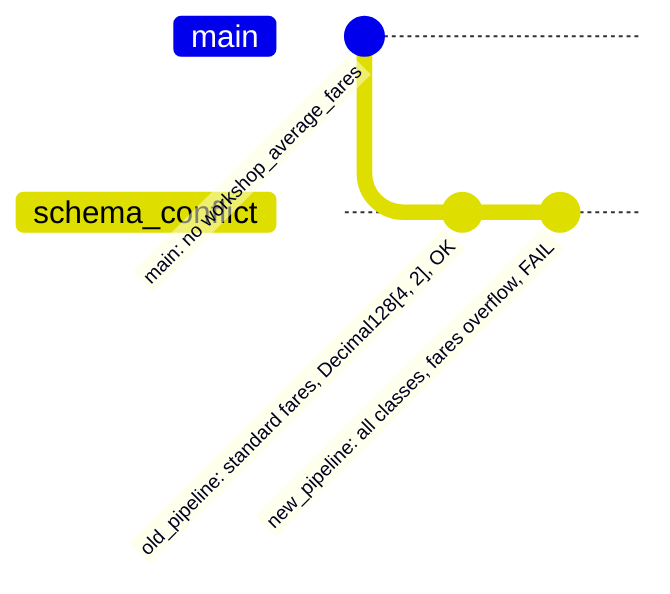

# Schema conflict

Demonstrates how a Bauplan type contract and an expectation together catch a subtle schema drift between two versions of the same pipeline and prevent the drift.

A first pipeline runs: it computes the mean Titanic fare per passenger class over standard fares only, and publishes `Fare` as a `Decimal128[4, 2]` so the money is exact rather than binary floating point. Its output schema declares that type, and an expectation checks that the fares being averaged actually fit that precision. A second pipeline then broadens the analysis to every class, splits by `Sex`, and adds a passenger count. Dropping the filter on `Pclass` pulls first class fares into the analysis, and those no longer fit the declared precision. Both pipelines run sequentially on the same branch with strict mode on. The expectation fires on the widened input, halts the run, and no drift happens.

## Scenario


```mermaid
gitGraph
   commit id: "main: no workshop_average_fares"
   branch schema_conflict
   checkout schema_conflict
   commit id: "old_pipeline: standard fares, Decimal128[4, 2], OK"
   commit id: "new_pipeline: all classes, fares overflow, FAIL"
   checkout main
```

## Pipelines

| Pipeline | Source table | Filter | Groups by | Output columns | Fare type |
|---|---|---|---|---|---|
| `old_pipeline` | `bauplan.titanic` | `Pclass > 1` | `Pclass` | `Pclass`, `Fare` | `Decimal128[4, 2]` |
| `new_pipeline` | `bauplan.titanic` | none | `Pclass`, `Sex` | `Pclass`, `Sex`, `Fare`, `n_passengers` | `Decimal128[4, 2]` (too narrow) |

Both pipelines ship the same expectation: every fare must fit `Decimal128[4, 2]`.

Why the widened scope breaks the type:

| Scope | Largest fare | Largest mean fare | Fits `Decimal128[4, 2]` (max 99.99)? |
|---|---|---|---|
| Standard classes only | 73.50 | 20.66 (second class) | yes |
| Every class, split by `Sex` | 512.33 | 106.13 (first class women) | no |

## Usage

```sh
uv run main.py [OPTIONS]
```

Run `uv run main.py --help` to see all available options.

### Options

| Option | Default | Description |
|---|---|---|
| `--profile` | `default` | Bauplan profile to use. |

### Expected output

```
=== Step 1: ship the old pipeline (mean standard fare per Pclass, Fare: Decimal128[4, 2]) ===

Old pipeline succeeded; expectation passed (fares fit Decimal128[4, 2])
workshop_average_fares is now published

Schema of workshop_average_fares:
    Pclass               long
    Fare                 decimal(4, 2)

=== Step 2: build the new pipeline (all classes, adds Sex, n_passengers) ===

Running the new pipeline...
New pipeline run blocked by the expectation, as expected. Status: JobStatus.failed. Reason: ...

Schema of workshop_average_fares after the new pipeline was blocked:
    Pclass               long
    Fare                 decimal(4, 2)
```

## What to observe

After the old pipeline runs, `workshop_average_fares` on the branch has `Fare: Decimal128[4, 2]`. The new pipeline fails on the expectation and Bauplan attempts no merge, not even on the current branch. The transactional branch catches the overflow before it spreads.

The fix is a deliberate one: widen the column to `Decimal128[5, 2]` in the output schema and raise `MAX_FARE` so the expectation checks the new bound. Both edits are visible in review, which is the point.

## Why this matters

The output schema and the expectation do different jobs, and this example is built so that both contribute.

The schema specifies expected types. Declaring `Fare` as `Decimal128[4, 2]` states, in code that Bauplan enforces, that this column is exact money and not a float. A type contract catches a column whose type drifts, and it catches it when the model returns, before anything materializes. That makes a whole class of expectation redundant: there is no need to write a check asserting a column has a given type, because the declared schema already guarantees it.

The expectation validates the data values. A declared precision is a promise about the data, and `Decimal128[4, 2]` is only a legitimate choice while the fares stay under 99.99. Nothing about the type says whether that is still true, and the answer changes with the data and with the scope of the query. That is what the expectation checks, and it is why broadening the filter is caught here rather than surfacing as an overflow deep inside a model, or worse, as silently rounded money in a downstream report.

Schema drift rarely arrives as an obvious break. It slips in as a one-line change to a filter, and the pipeline still "works." The output table is still there. What changes is the contract with whoever reads the table, and that break surfaces far from where someone introduced it. Because both the schema and the expectation are part of the pipeline DAG and the pipeline runs with `strict="on"`, they fire automatically and fail the run before the branch reaches a mergeable state.
