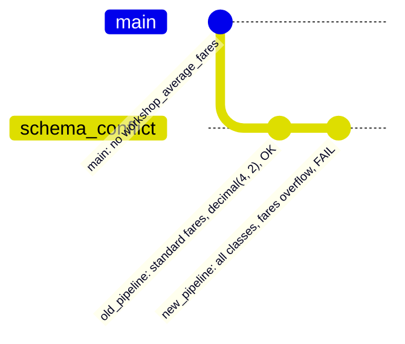

# Schema conflict

Demonstrates how an expectation catches a precision assumption change when a pipeline broadens its input data.

A first pipeline computes the mean Titanic fare per passenger class over standard fares only. The model casts `Fare` to `pl.Decimal(4, 2)`, while the output schema declares `Fare` as `bauplan.Any` because decimal types cannot currently be pinned by a Bauplan type contract. An expectation checks that the fares being averaged fit the model's decimal precision. A second pipeline broadens the analysis to every class, splits by `Sex`, and adds a passenger count. First class fares exceed the supported precision, so the expectation fails and strict mode halts the run.

## Scenario


```mermaid
gitGraph
   commit id: "main: no workshop_average_fares"
   branch schema_conflict
   checkout schema_conflict
   commit id: "old_pipeline: standard fares, decimal(4, 2), OK"
   commit id: "new_pipeline: all classes, fares overflow, FAIL"
   checkout main
```

## Pipelines

| Pipeline | Source table | Filter | Groups by | Output columns | Model cast | Schema field |
|---|---|---|---|---|---|---|
| `old_pipeline` | `bauplan.titanic` | `Pclass > 1` | `Pclass` | `Pclass`, `Fare` | `pl.Decimal(4, 2)` | `bauplan.Any` |
| `new_pipeline` | `bauplan.titanic` | none | `Pclass`, `Sex` | `Pclass`, `Sex`, `Fare`, `n_passengers` | `pl.Decimal(4, 2)` | `bauplan.Any` |

Both pipelines ship the same expectation: every source fare must fit the maximum value supported by `decimal(4, 2)`.

Why the widened scope breaks the precision assumption:

| Scope | Largest fare | Largest mean fare | Fits `decimal(4, 2)` (max 99.99)? |
|---|---|---|---|
| Standard classes only | 73.50 | 20.66 (second class) | yes |
| Every class, split by `Sex` | 512.33 | 106.13 (first class women) | no |

## Usage

```sh
uv run main.py [OPTIONS]
```

Run `uv run main.py --help` to see all available options.

### Options

| Option | Default | Description |
|---|---|---|
| `--profile` | `default` | Bauplan profile to use. |

### Expected output

```
=== Step 1: ship the old pipeline (mean standard fare per Pclass, Fare: decimal(4, 2)) ===

Old pipeline succeeded; expectation passed (fares fit decimal(4, 2))
workshop_average_fares is now published

Schema of workshop_average_fares:
    Pclass               long
    Fare                 decimal(4, 2)

=== Step 2: build the new pipeline (all classes, adds Sex, n_passengers) ===

Running the new pipeline...
New pipeline run blocked by the expectation, as expected. Status: JobStatus.failed. Reason: ...

Schema of workshop_average_fares after the new pipeline was blocked:
    Pclass               long
    Fare                 decimal(4, 2)
```

## What to observe

After the old pipeline runs, the materialized `workshop_average_fares` table has `Fare: decimal(4, 2)` because the model returns that Arrow type. The schema contract uses `bauplan.Any` for `Fare`, so it does not enforce the decimal type or precision. The new pipeline fails on the expectation and Bauplan attempts no merge. The transactional branch contains the failed change.

The fix requires widening the model cast to `pl.Decimal(5, 2)` and raising `MAX_FARE` so the expectation checks the new bound. The schema field remains `bauplan.Any`.

## Why this matters

The expectation is the mechanism that protects the decimal precision in this example.

The output schema still enforces the other declared columns. For `Fare`, `bauplan.Any` means the contract accepts the runtime Arrow type without pinning it. It cannot detect a change in decimal precision.

The expectation validates the assumption behind the `pl.Decimal(4, 2)` cast: the selected fares must stay under 99.99. That assumption changes when the filter changes, so it requires a value-level check.

With a Bauplan decimal schema field, the contract can pin the output type and precision. The expectation still checks whether the input values respect the precision chosen by the model. With `strict=True`, the current expectation failure stops the run before the branch can be merged.
