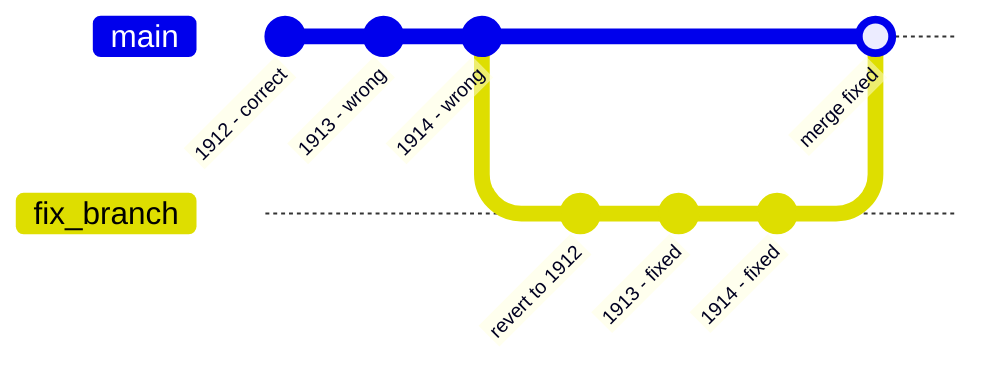

# Reprocessing race conflict

Demonstrates how to fix and backfill a corrupted table.

A scheduled job appends inflation-adjusted fares year-by-year to a shared fare table. The update pipeline carries a bug, a missing `+ 1.0` in the exponentiation, that causes fares to collapse toward zero instead of growing. When you discover the bug, you must revert the table to the initial 1912 snapshot, replay every past year with the correct formula, and merge the corrected table back into the user branch.

## Scenario




## Pipelines

| Pipeline | Strategy | Purpose |
|---|---|---|
| `setup_table` | `REPLACE` | Creates the initial fare snapshot at the 1912 baseline |
| `update_table_wrong` | `APPEND` | Appends yearly fares with the buggy inflation formula |
| `update_table_fixed` | `APPEND` | Appends yearly fares with the correct inflation formula |

## Usage

```sh
uv run main.py [OPTIONS]
```

Run `uv run main.py --help` to see all available options.

### Options

| Option | Default | Description |
|---|---|---|
| `--profile` | `default` | Bauplan profile to use. |

### Expected output

```
Working on branch: <USER>.reprocessing_race_main

=== Step 1: initialise 'workshop_fare_table' at the 1912 baseline ===

Initial state available at: <USER>.reprocessing_race_main@9aa233041c2ab884b440d3798a11e41dd71e16036271d0aae5c4abeabd34b039

=== Step 2: append 1913-1914 with the buggy formula ===

[1913] Appended with wrong inflation formula.
  avg fare by year:
    1912: $32.2042
    1913: $6.4408
[1914] Appended with wrong inflation formula.
  avg fare by year:
    1912: $32.2042
    1913: $6.4408
    1914: $1.2882

[!!!] Bug discovered: inflation formula is missing '+ 1.0', fares are collapsing instead of growing.

[fix] Starting fix and backfill in background...
  [fix] Table reverted to initial snapshot (<USER>.reprocessing_race_main@9aa233041c2ab884b440d3798a11e41dd71e16036271d0aae5c4abeabd34b039)
  [fix] Backfilling 1913-1914 with correct formula...
  [fix] Backfilled 1913
  [fix] Backfilled 1914
[fix] Fixed table merged back into main branch.


=== Final state of 'workshop_fare_table' on <USER>.reprocessing_race_main ===

  avg fare by year:
    1912: $32.2042
    1913: $38.6450
    1914: $46.3741
```

## What to observe

- After step 2, fares collapse year-on-year. The bug is obvious from the numbers themselves, not from any exception.
- The backfill runs entirely on `fix_branch` and is only swapped back in via a single merge at the end. From the scheduler perspective, the table "changes" exactly once, atomically.

## Why this matters

In production, a pipeline like "append a yearly slice to a fare table" is almost always owned by a scheduler such as Airflow, cron, or Prefect. When you find a bug in historical rows, Bauplan's Git-like branching makes it possible to revert back to the original, uncorrupted state, replay the historical data with the now-fixed pipeline, and finally update the lake with the amended version of the data.

This example is admittedly a somewhat academic scenario, but it illustrates cleanly how branching gives you a safe surface to perform historical corrections without touching production data until you are confident the fix is right.

It is worth being explicit about when this flow can break down. The approach assumes that no concurrent writers have modified the underlying table between the moment you branch off and the moment you merge back. In practice, if other pipelines are appending to or modifying that same table while your recovery branch is in flight, merging back may produce conflicts.
