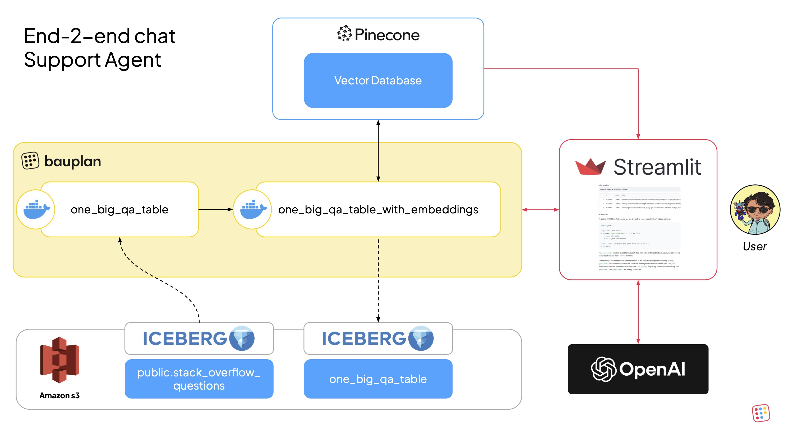

# RAG with Bauplan and Pinecone

Build an end-to-end Retrieval-Augmented Generation (RAG) pipeline using Bauplan for data preparation and [Pinecone](https://www.pinecone.io/) for vector storage and retrieval. The [Streamlit](https://streamlit.io/) app lets users ask programming questions and get answers grounded in real Stack Overflow content.

We use the Stack Overflow Dataset (originally from [Kaggle](https://www.kaggle.com/datasets/stackoverflow/stacksample?select=Questions.csv)) - available as a sample dataset in the Bauplan sandbox.

## Overview

The pipeline has two models:

1. `one_big_qa_table` - joins questions, answers, and tags into a single table using DuckDB.
2. `one_big_qa_table_with_embeddings` - generates embeddings via Pinecone's inference API, computes 2-D t-SNE projections for visualization, uploads the vectors to a Pinecone index (`so-qa-index`), and materializes the final table with embeddings back to the lakehouse.

### Data flow

1. The Iceberg tables (`stack_overflow_questions`, `stack_overflow_answers`, `stack_overflow_tags`) are available in the Bauplan sandbox.
2. The pipeline in `pipeline/` joins the tables, computes embeddings, and uploads them to Pinecone.
3. The Streamlit app in `app/` retrieves embeddings from Bauplan for visualization and uses Pinecone + an LLM for real-time Q&A.



## Additional setup

- A [Pinecone](https://www.pinecone.io/) account and API key - sign up, create a cluster, and note your API key from the dashboard
- An [OpenAI](https://platform.openai.com/) API key for the Q&A feature in the Streamlit app. The app uses `gpt-5.4` by default.

## Run

### Explore the dataset

```sh
bauplan table get stack_overflow_questions
bauplan query "SELECT id, title FROM stack_overflow_questions LIMIT 10"
```

### Run the pipeline

Create a data branch, add the Pinecone key as a secret, and run:

```sh
bauplan checkout -b <YOUR_USERNAME>.rag_pipeline
bauplan parameter set pinecone_key "<YOUR_PINECONE_KEY>" --type secret --project-dir pipeline
bauplan run --project-dir pipeline
```

The pipeline joins the three tables into `one_big_qa_table`, then generates embeddings via Pinecone's inference API and uploads them to a Pinecone index (`so-qa-index`). The final table `one_big_qa_table_with_embeddings` includes the embeddings and 2-D t-SNE vectors for visualization.

### Verify results

```sh
bauplan table get one_big_qa_table_with_embeddings
bauplan query "SELECT question_id, tags FROM one_big_qa_table_with_embeddings LIMIT 10"
```

### Run the app

```sh
OPENAI_API_KEY=<YOUR_OPENAI_KEY> PINECONE_KEY=<YOUR_PINECONE_KEY> \
    uv run python -m streamlit run app/explore_and_answer.py
```

The app displays a 2-D scatter plot of the embedding space (color-coded by tag) and provides a Q&A interface - ask a programming question and it uses Pinecone to find the nearest Stack Overflow answers, then feeds them as context to an LLM to generate a grounded response.
