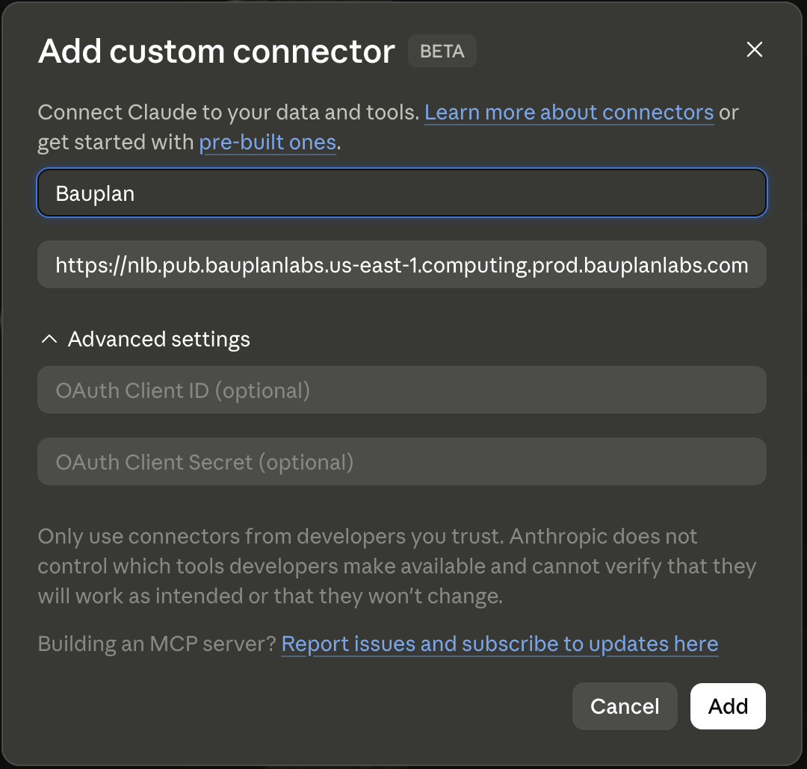
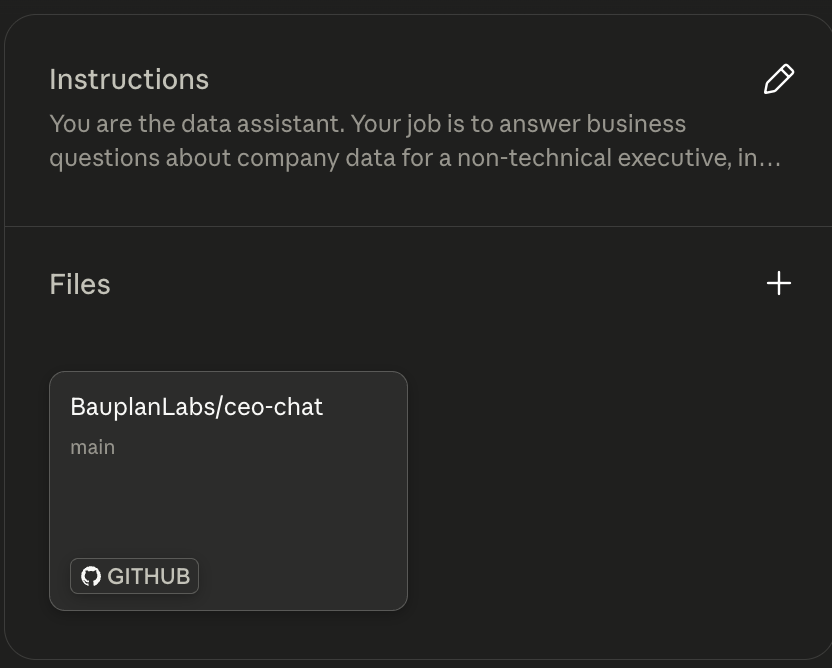

# Executive questions with MCP

<!-- vale Google.Acronyms = NO -->

## Table of contents

- [Overview](#overview)
- [The two paths](#the-two-paths)
- [How the loop closes](#how-the-loop-closes)
- [Repository structure](#repository-structure)
- [Adapting the template](#adapting-the-template)
- [Setting up the workflow](#setting-up-the-workflow)

## Overview

This project removes the manual step between an executive asking a data question and an engineer building a pipeline to answer it.

This project connects a GitHub repository to a chat interface like Claude Desktop and let the user ask questions and retrieve answers using Bauplan's MCP server. 

The repository acts as the knowledge base: it contains the lakehouse architecture, the semantic layer describing what the data means, and the Python code for existing pipelines. A non-technical executive connects their chat client to this repository once. From then on:

- Software engineers update the repository when they add pipelines, change table schemas, or adjust semantics. The executive's chat client picks up the changes automatically. There is nothing to install or reconfigure on their end, at most a chat client refresh.
- The executive asks questions in plain language. The chat agent answers them directly, using the lakehouse as the data source via the Bauplan MCP server.

## The two paths

Every question the executive asks resolves to one of two cases.

**Path A: the answer already exists.** A table in the lakehouse holds the data the question asks for. The agent queries it and returns the result. The agent writes nothing and reviews nothing.

**Path B: the answer does not exist yet.** No existing table answers the question, but the data may still be one query away. The agent does two things in sequence: it runs the query and returns the result to the executive immediately, so they are not waiting. It then files a Linear issue that hands the work of turning that query into a permanent pipeline off to an automated agent.

The executive only ever sees the answer. The machinery underneath, whether a direct query or the issue-filing, is invisible to them.

## How the loop closes

When the agent files a Linear issue for path B, the following happens automatically.

1. Linear syncs the issue to GitHub.
2. A GitHub Action picks it up and runs a Claude Code agent against this repository.
3. The agent reads the issue, the lakehouse architecture in `docs/lakehouse.md`, and the semantic layer in `docs/semantics.md`, then converts the one-off query into a proper medallion pipeline: silver base models, any necessary enriched silver models, and a gold model with `materialization_strategy='REPLACE'`.
4. The agent validates the pipeline with `bauplan run --dry-run --strict on` and opens a pull request.
5. An available engineer reviews the pull request, checks correctness, and merges.
6. On merge, a scheduler (not provided here) picks up the new pipeline and materializes the gold table on `main`.

From that point on, the same question hits path A: the table exists, and the agent queries it directly.

## Repository structure

```
template/
    CLAUDE.md               operational rules for agents in this repo
    .github/
        workflows/
            claude.yml      github action to trigger Claude Code on github runner

    docs/
        workflow.md         end-to-end decision logic (query vs. build)
        answering.md        how to communicate results to the executive
        linear.md           recipe for filing the handoff Linear issue
        semantics.md        business meaning of the data
        lakehouse.md        medallion architecture and pipeline rules
    src/
        pipelines/
            silver/         silver models and expectations
            gold/           gold models and expectations
    pyproject.toml
```

The `template/` directory is a ready-to-use starting point. `CLAUDE.md` is the file to point a Claude Code agent's project instructions at when it processes Linear issues in the GitHub Action. `docs/answering.md` is the file to point the executive-facing chat assistant at.

## Adapting the template

The template ships with TPC-H as the example dataset. To use it with a real lakehouse:

1. Replace `docs/semantics.md` with a semantic layer describing your own data: what entities exist, what metrics mean, and what ambiguities to resolve before writing a query.
2. Update `docs/lakehouse.md` to reflect your actual namespaces and existing tables.
3. Replace or extend the pipeline code in `src/pipelines/` with your existing silver and gold models.
4. Update `docs/linear.md` with the correct Linear project, team, and assignee for your organization.

The workflow logic in `docs/workflow.md` and `CLAUDE.md` does not need to change unless you are replacing Linear or Bauplan with different tools.

## Setting up the workflow

### Bauplan MCP server

In Claude Desktop, go to `Customize > Connectors > + > Add custom connector`. Use any name, typically Bauplan, and set the remote MCP server URL to `https://nlb.pub.bauplanlabs.us-east-1.computing.prod.bauplanlabs.com/mcp`. Claude Desktop will then prompt you to authenticate with your Bauplan API key, which starts with `bpln-sdk-`.



### Claude project

In Claude Desktop, go to `Projects > New Project > Create Project`. Under `Instructions`, add a system prompt such as:

```
You are the data assistant. Your job is to answer business questions about
company data for a non-technical executive, in this chat. The repository
docs are the source of truth; read them before answering.

Start with docs/answering.md, which governs how you respond.
How an answer gets produced is in docs/workflow.md.
Use docs/semantics.md to map a question to what the data means, and
docs/lakehouse.md for how tables are layered. Operational rules are in CLAUDE.md.
```

Then add the repository via `File > + > GitHub`.



### Linear

1. Create a team in Linear for the project.
2. Create a project and assign it to that team.
3. Go to `Settings > Integrations > GitHub` and connect the Linear team to the target GitHub repository. This enables Linear to auto-generate a GitHub branch for each issue and keeps the two systems in sync.
4. Configure the Linear branch format so that generated branch names avoid forward slashes, for example `<username>-<issue-id>` instead of `<username>/<issue-id>`.
5. Follow the instructions at [https://linear.app/docs/mcp](https://linear.app/docs/mcp) to add the Linear MCP server to your chat interface.

### GitHub

You need no GitHub configuration beyond the Linear integration above. The `claude.yml` workflow file in `.github/workflows/` handles everything else.

Add the following secrets under `Settings > Secrets and variables > Actions`:

| Secret | Description |
|--------|-------------|
| `ANTHROPIC_API_KEY` | Anthropic API key used to run Claude Code. Must have API credits. |
| `BAUPLAN_API_KEY` | Bauplan API key used by Claude to interact with the data lakehouse. |