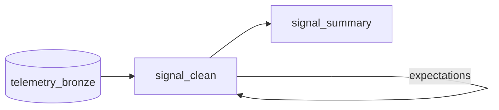

# Medallion Architecture for Telemetry Data

Implement the [medallion architecture](https://www.databricks.com/glossary/medallion-architecture) (Bronze-Silver-Gold) for sensor telemetry data. The pipeline cleans and aggregates raw sensor readings through three layers, with data quality checks between stages and a [Streamlit](https://streamlit.io/) dashboard to visualize the results.

## Overview

Raw telemetry readings arrive in a Bronze table (`telemetry_bronze`) containing timestamped sensor values. The pipeline transforms this data through two stages:

1. **Bronze to Silver** (`signal_clean`): parse, clean, and deduplicate raw readings using DuckDB - cast value strings to floats, remove nulls, rename columns, and keep only the highest value per sensor per timestamp.
2. **Silver to Gold** (`signal_summary`): aggregate clean readings into hourly per-sensor statistics (count, mean, min, max) using Polars.

Between Bronze and Silver, expectation tests validate that no null values remain in the `dateTime`, `signal`, or `value` columns.



## Running the pipeline

Create a branch and run:

```sh
bauplan checkout -b <YOUR_USERNAME>.medallion_telemetry
bauplan run --project-dir pipeline
```

The pipeline will:
- Read raw sensor data from `telemetry_bronze`
- Clean and deduplicate it into `signal_clean` (Silver)
- Run expectation tests to validate data quality
- Aggregate into `signal_summary` (Gold) with hourly statistics per sensor

## The dashboard

The Streamlit app in `app/viz_app.py` queries the Gold table (`signal_summary`) and displays:

- **Hourly Average Reading per Sensor** - line chart of sensor values over time
- **Per-Sensor Stats** - table and bar chart showing mean, min, max, and total readings per sensor
- **Hourly Reading Volume** - stacked bar chart of reading counts by sensor

To run it, first merge your branch to main, then:

```sh
uv run streamlit run app/viz_app.py
```
